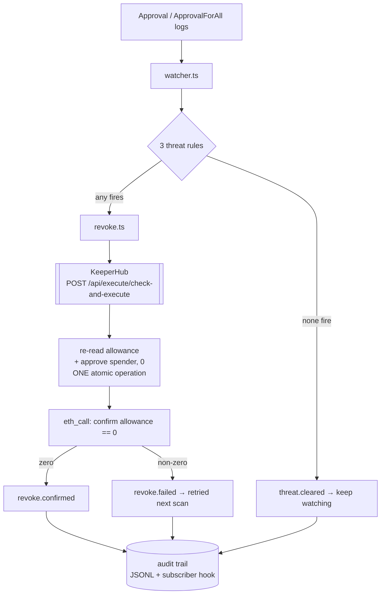
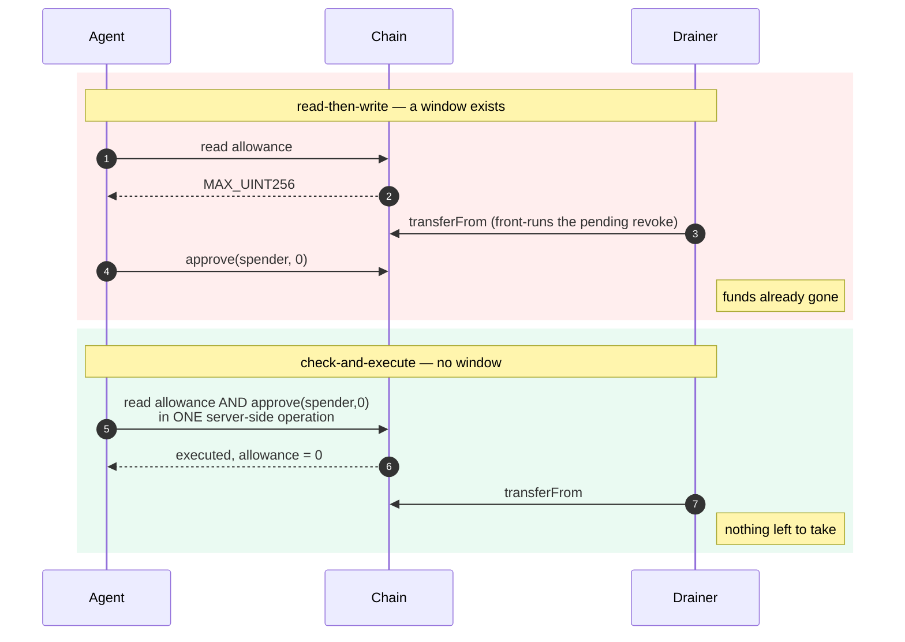

# Architecture

Revoker is a security agent with one job: notice that a token approval has
turned dangerous, and take it away before the drain completes.

The whole design follows from one observation — **detection is a commodity and
response is not**. Approval scanners and wallet trust scores already exist,
including on KeeperHub's own marketplace (`token-approval-risk-scanner-*`,
`wallet-trust-score-*`). They tell you an approval is risky. None of them act.
An alert that arrives at 3am is an alert nobody reads.

---

## The loop

Reads go straight to an RPC; writes go exclusively through KeeperHub. That split
is deliberate: the watcher polls continuously and a round trip through an
execution API would add latency to the one number that matters, while nothing
read locally is ever trusted for the actual decision — `check-and-execute`
re-reads state server-side regardless.

---

## The one decision that matters

The revoke uses `check-and-execute`, not a read followed by a write.

A read-then-write agent decides at time T and acts at time T+n. That window is
exactly what a drainer watching the mempool needs — it sees the pending revoke
and front-runs it with a `transferFrom`. Closing the window is the difference
between a security agent and a script that usually wins.

KeeperHub reported `observedValue: 115792089237316195423570985008687907853269984665640564039457584007913129639935`
at execution time on the reference run, evaluated against live chain state, not
a value this process passed in.

---

## Threat rules

Three concrete, auditable rules. Every firing carries the evidence that produced
it into the audit trail, so a revoke can be justified after the fact.

| Rule | Fires when | Source |
|---|---|---|
| `unlimited-to-unverified` | `MAX_UINT256` allowance to a contract whose source is unreadable | KeeperHub ABI resolution |
| `young-spender` | spender deployed < 7 days ago | `eth_getCode` + binary search |
| `denylisted` | spender is on the known-bad list | `data/denylist.json` |

**Any one rule firing is sufficient.** These are independent signals of
different kinds, not weighted terms in a score. Requiring consensus would mean
ignoring a confirmed deny-list hit because the contract happened to be verified
and old.

Deliberately **not** an ML maliciousness classifier. An agent that moves funds on
an opaque score is not auditable, and *the model said so* is not a defence when
it is wrong. The cost of that choice is stated plainly: a spender that is
verified, aged, and absent from the deny-list trips nothing.

`young-spender` costs one `eth_getCode` in the common case — if code already
existed at the 7-day cutoff, the contract cannot be young and the rule stops
there. The binary search for exact age runs only on the rare firing path.

---

## Failure modes

Reliability is a judged criterion, but more to the point, an agent whose whole
premise is *still watching at 3am* has to survive the night.

| Failure | Behaviour |
|---|---|
| RPC or API error mid-scan | logged, loop continues — a transient failure must not kill the watcher |
| KeeperHub 429 / 5xx | exponential backoff honouring `Retry-After`, up to 4 retries (5 requests total) |
| KeeperHub 4xx | **not** retried — a bad request stays bad, and replaying a write risks double-execution |
| Rate limit approached | client-side pacing at 60 req/min, before the server has to reject |
| Revoke reports success but allowance is non-zero | reported as `revoke.failed`, retried next scan |
| Allowance already zero at execution time | condition fails, no gas spent, logged as `revoke.skipped` |
| Archive state unavailable | `young-spender` returns `INDETERMINATE`, never "safe" |
| Audit write fails | swallowed — losing a log is bad, failing to revoke because of it is worse |

An exposure is marked handled **only** once the chain confirms the allowance is
zero, so a failed revoke is retried rather than silently dropped.

---

## Why KeeperHub is the engine, not decoration

Remove KeeperHub and Revoker needs seven separate systems: a transaction
relayer, a congestion-aware gas oracle with backoff, an MEV-protected submission
route, a status and confirmation poller, an action-discovery layer, an ABI
resolution service, and an audit-log pipeline — plus a custody solution.

The custody point is the sharpest one. KeeperHub signs through a Turnkey
enclave, so **this process never holds a private key**. An autonomous agent with
a hot key that can move funds is a liability; one that can only ask a
policy-bound signer to act is not.

Surfaces used:

| Surface | Used for |
|---|---|
| `POST /api/execute/check-and-execute` | the atomic revoke |
| `POST /api/execute/contract-call` | arming the demo approval, contract writes |
| `POST /api/execute/transfer` | native transfers |
| `GET /api/execute/{id}/status` | confirmation, gas, sponsorship, audit record |
| `GET /api/chains` | network + explorer resolution |
| `GET /api/chains/{id}/abi` | **source-verification signal for rule 1** |
| `GET /api/user/wallet` | signer identity assertion |
| `GET /api/user/wallet/balances` | token discovery (curated registry) |
| `simulate: true` | dry-run validation in the integration spike |
| `Idempotency-Key` | safe retries without double-execution |

---

## Constraints discovered by building it

Two shaped the design, and both are surfaced rather than hidden.

**Token discovery needs an explicit watchlist.** No public RPC serves an
address-less `eth_getLogs` over a useful block range — publicnode requires an
address filter, 1rpc caps the range at 50 blocks. KeeperHub's balances endpoint
only covers a curated token registry and cannot see arbitrary tokens.
Production resolves this from an indexer; the MVP watches what it is told to
watch and says so.

**The signer is the victim, necessarily.** `approve(spender, 0)` clears
`msg.sender`'s allowance, and KeeperHub signs only for the org's Turnkey
account. So that account is both the watched wallet and the revoke sender. The
spike asserts the configured address matches the one KeeperHub controls and
fails loudly otherwise.

---

## Not built, and why

**GuardVault** — a per-user gas escrow was specced so the agent would be
economically self-sufficient. Its justification was that the Sepolia demo pays
its own gas. Measurement killed it: every execution came back `sponsored: true`
with the signer's balance byte-for-byte unchanged. Building an escrow for a cost
that did not materialise would have been ceremony, so it was cut rather than
shipped as decoration. Production gas economics still assume gas is a real cost,
because the sponsorship *policy* is undocumented.
