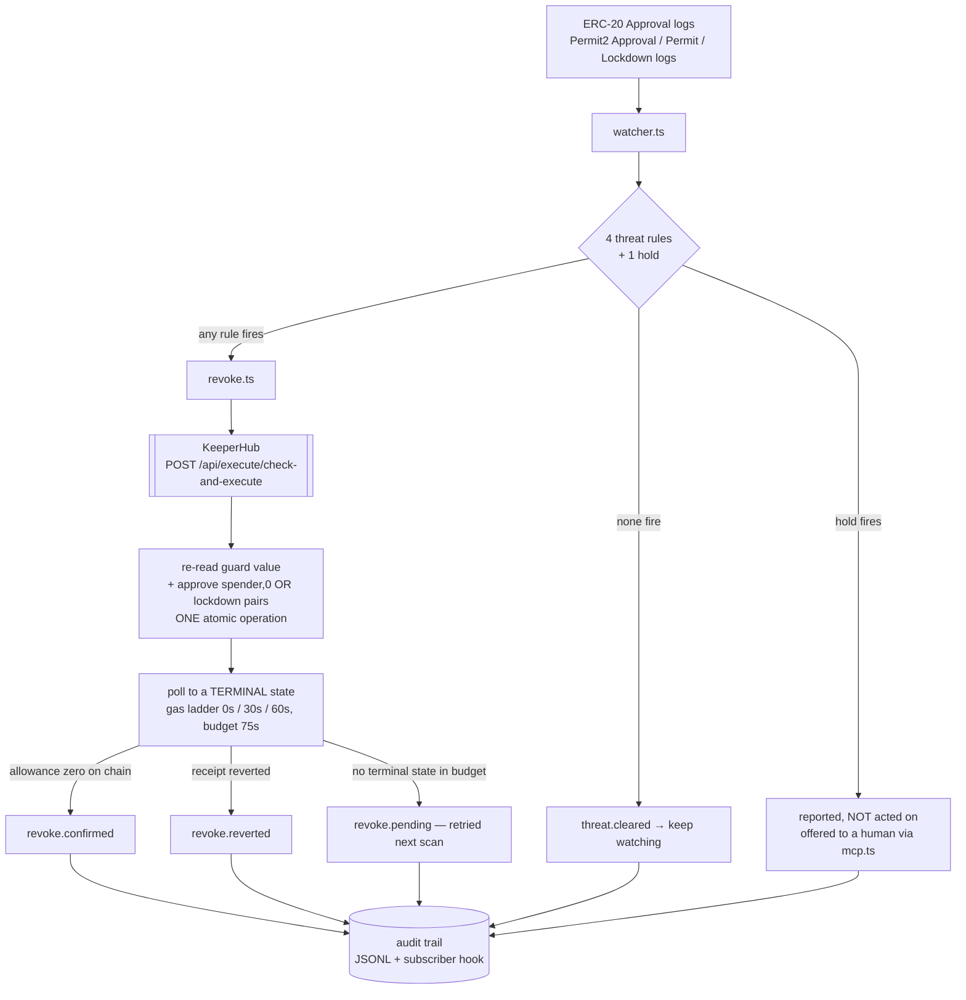
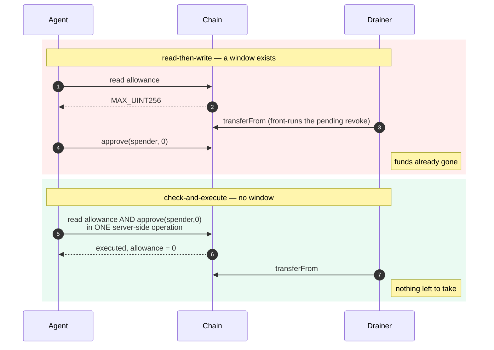

# Architecture

Revoker is a security agent with one job: notice that a token approval has
turned dangerous on a wallet nobody is watching, and take it away.

## Who this is for, and why the architecture says so

The design follows from a constraint that most of this product category quietly
ignores.

`approve(spender, 0)` clears the allowance of **`msg.sender`** and nobody
else's. KeeperHub signs exclusively for the organisation's Turnkey account.
Therefore the watched wallet and the revoke sender are **necessarily the same
account** — Revoker can only protect a wallet its signer already controls.

That rules out the retail drain victim entirely. It rules *in* the wallets that
are already programmatically custodied and have no human attached: trading bots,
liquidation keepers, rebalancers, cross-venue arbitrage signers, and DeFi
automation running on KeeperHub, Gelato, OpenZeppelin Relayer, Turnkey or
Fireblocks.

Those wallets are the right target for three architectural reasons, not just
marketing ones:

- **The constraint is satisfied by definition.** A keeper wallet is a
  programmatic signer. There is no "connect your wallet" step to design around,
  and no custody question to answer, because custody is the premise.
- **Approvals accumulate as sediment.** Every venue integration grants a router
  approval, usually unlimited because re-approving per trade costs gas forever.
  Nobody grants them deliberately and nobody audits them, which is why a
  *policy* engine beats a dashboard: there is no human in the loop to alert.
- **The revoke has to be defensible after the fact.** A keeper sits behind a
  risk committee. So every decision here is deterministic and carries its
  evidence into a durable trail — no model, no score, no sampling temperature.

**Detection is a commodity; response is not.** Approval scanners and wallet
trust scores already exist, including on KeeperHub's own marketplace
(`token-approval-risk-scanner-*`, `wallet-trust-score-*`). They tell you an
approval is risky. None of them act, and an alert that arrives at 3am for a
wallet with no human attached is an alert nobody will ever read.

---

## The loop



Reads go straight to an RPC; writes go exclusively through KeeperHub. That split
is deliberate: the watcher polls continuously and a round trip through an
execution API would add latency to the one number that matters, while nothing
read locally is ever trusted for the actual decision — `check-and-execute`
re-reads state server-side regardless.

---

## The one decision that matters

The revoke uses `check-and-execute`, not a read followed by a write.



A read-then-write agent decides at time T and acts at time T+n. That window is
exactly what a drainer watching the mempool needs — it sees the pending revoke
and front-runs it with a `transferFrom`. Closing the window is the difference
between a security agent and a script that usually wins.

This is *not* a claim that Revoker beats an attacker to the mempool. It does not
try to. The product bet is on the precondition — an allowance that is already
zero has nothing to exploit — and this section is only about not re-opening a
race inside our own write path.

KeeperHub reported `observedValue: 115792089237316195423570985008687907853269984665640564039457584007913129639935`
at execution time on the reference run, evaluated against live chain state, not
a value this process passed in.

---

## Two approval surfaces, two revoke primitives

| Surface | Detection | Revoke | Batching |
|---|---|---|---|
| ERC-20 allowance mapping | token's own `Approval` logs | `approve(spender, 0)` | one tx per exposure |
| Permit2 allowance ledger | Permit2's `Approval` / `Permit` / `Lockdown` logs | `lockdown([(token, spender), …])` | **N slots, one tx** |

Permit2 matters because it is the surface an ERC-20 watcher is *structurally*
blind to. A signature-based grant writes Permit2's own
`allowance[owner][token][spender]` slot without the token contract being
touched, so the token emits nothing — no `Approval`, no state change in its own
mapping. The grant appears on chain inside the attacker's transaction, with no
wallet prompt that ever named an allowance.

The detection shape is inverted, which is why this is not a two-line addition:
ERC-20 logs are filtered *by token address* with the spender in the topics;
Permit2 logs are filtered by *the single canonical Permit2 address* with the
token as a topic. Three separate queries rather than one, because `Lockdown`
indexes only `owner` and cannot ride the same topic filter as `Approval` and
`Permit` — splitting them keeps the `owner` filter server-side on all three,
which is what stops it downloading every Permit2 log on the chain.

Three semantics that differ from ERC-20 and are each pinned by tests:

- **Unlimited is `type(uint160).max`,** not `type(uint256).max`. The amount is
  packed into 160 bits. Comparing against `MAX_UINT256` would score every
  unlimited Permit2 grant as bounded and quietly clear it.
- **Expiry is compared against chain time,** never host time, using the same
  strict `>` that `AllowanceTransfer` uses — so an allowance is still live on
  the expiration second itself. A `>=` would declare it dead one second early,
  and "dead" means we stop watching it.
- **An expired allowance is not an exposure.** Permit2 reverts the transfer, so
  `lockdown()` there would burn gas zeroing a number nobody can use.

---

## The Permit2 guard detour — a real platform limit, worked around without loss

`check-and-execute`'s condition schema is exactly `{operator, value}`. There is
no output index, no tuple path, no member selector.

`Permit2.allowance()` returns `(uint160 amount, uint48 expiration, uint48
nonce)`. Guarding on it therefore does not read the wrong member — there is **no
scalar to compare at all**. The evaluator reported `observedValue: undefined`,
scored `gt 0` as false, and **silently skipped the write**, logging a tidy
`revoke.skipped … reason=guard slot already zero` while leaving an armed,
unlimited, correctly-detected grant fully live.

Mocked tests passed. A dry-run simulation passed. Only a real transaction found
it. A guard that silently declines to fire is worse than no guard, because it
reads as success.

The fix keeps atomicity intact. `contracts/src/Permit2AllowanceView.sol` is a
723-byte, ownerless, storageless, non-payable view contract whose
`liveAmountOf()` flattens the tuple to one `uint160` **and folds in the expiry
check**, so the server-side re-read agrees with the watcher rather than being
laxer than it. Permit2's address is a compile-time constant, so the helper can
never be re-pointed at an attacker's contract to fake a live allowance and bait
a revoke.

It is still **one** `check-and-execute`:

```
check   →  Permit2AllowanceView.liveAmountOf(owner, token, spender)   gt 0
action  →  Permit2.lockdown([(token, spender), …])
```

Only *which view function is read* changed — never *when*. `permit2.ts` resolves
the helper's address at revoke time (not import time, so a missing entry takes
down only the Permit2 path) and **throws rather than returning undefined**, so
no caller can treat "not deployed" as "guard not needed". A guardless lockdown
would land, and would trade away the single property this project sells.

---

## Threat rules

Four concrete, auditable rules and one hold. Every firing carries the evidence
that produced it into the audit trail.

| Rule | Fires when | Source |
|---|---|---|
| `unlimited-to-unverified` | `MAX_UINT256` allowance to a contract whose source is unreadable | KeeperHub ABI resolution |
| `young-spender` | spender deployed < 7 days ago | `eth_getCode` + binary search |
| `denylisted` | spender is on the known-bad list | `data/denylist.json` |
| `permit2-long-lived` | Permit2 grant valid > 30 days out, unverified spender | Permit2 `allowance()` + chain time |

**Any one rule firing is sufficient.** These are independent signals of
different kinds, not weighted terms in a score. Requiring consensus would mean
ignoring a confirmed deny-list hit because the contract happened to be verified
and old.

30 days is not a taste call: it is the expiration Uniswap's own interface writes
for a routine swap approval, so it is the ceiling of normal. A grant that
outlives it was either deliberately widened or signed blind.

Deliberately **not** an ML maliciousness classifier. An agent that moves funds on
an opaque score is not auditable, and *the model said so* is not a defence when
it is wrong. The cost of that choice is stated plainly: a spender that is
verified, aged, absent from the deny-list and not a long-lived Permit2 grant
trips nothing.

`young-spender` costs one `eth_getCode` in the common case — if code already
existed at the 7-day cutoff, the contract cannot be young and the rule stops
there. The binary search for exact age runs only on the rare firing path.

Both rules that consult source verification, and `permit2-long-lived` when chain
time is unavailable, **fail closed** — they return `INDETERMINATE` and name the
remedy rather than reporting "safe". A threat rule that degrades into a rubber
stamp is worse than one that admits it cannot see.

### The hold channel

`upstream-permit2-approval` is not a rule. It is a **hold**: same shape, same
evidence discipline, different list — so it can neither create a threat nor mask
one. The single gate the autonomous loop asks is `mayRevokeUnattended()`, and a
threat carrying a hold is reported and left alone.

It fires when the spender **is Permit2 itself**. That ERC-20 approval is the
upstream root of every Permit2 allowance for the token: Permit2 can only move
what the token has approved it to move.

- Downstream `lockdown()` is a **scalpel** — it zeroes exactly the slots that
  fired, costs one transaction, and nothing else in the wallet notices.
- Upstream `approve(PERMIT2, 0)` is an **amputation** — it breaks Uniswap, every
  router, and every dapp that routes that token through Permit2, silently, at
  the next swap, for a wallet whose owner is asleep and did not ask for it.

It is also the one approval most likely to be both unlimited and long-forgotten,
which is exactly what makes an automated agent likely to reach for it:
`unlimited-to-unverified` would fire on it the moment an explorer lookup blips.
So it is reported with its own identity, never revoked autonomously, and offered
to a human through the MCP surface where `confirm: true` is a person saying yes.

---

## Landing the transaction, not just submitting it

`check-and-execute` exposes **no fee override** — only `gasLimitMultiplier`. So
we do not get to name a tip. That is a property of the guarded path
specifically: KeeperHub's `execute_contract_call` schema carries a
`priority_fee_gwei`, and `execute_check_and_execute` does not. The only path
without a TOCTOU window is the only path without tip control, and we take that
trade every time.

```
rung 0   t=0s     first submission,  gasLimitMultiplier 1.2
rung 1   t=30s    resubmit,          gasLimitMultiplier 1.5
rung 2   t=60s    resubmit,          gasLimitMultiplier 2.0
give up  t=75s    report "pending" — explicitly NOT "failed"
```

30s is two and a half blocks, and sits **above** the slowest healthy response we
have measured: p95 25.17s, max 26.55s over 25 live cycles (BENCHMARK.md). An
earlier 24s rung sat *below* both, so more than 5% of perfectly healthy
executions tripped the ladder and paid for a rung they never needed.

### What the ladder is, and what it is not

An earlier version of this document claimed **"the resubmission IS the fee
bump"**. That is only true if KeeperHub *replaces* the stranded transaction at
the **same nonce**. If a resubmission gets a fresh nonce instead, rung 1 queues
*behind* rung 0 and structurally cannot be mined first — it bumps nothing.

**KeeperHub does not document which of the two it does**, so we no longer claim
it. The whole published corpus says exactly one thing about nonces — an FAQ line
listing "transaction retries, nonce management" among its production features —
and the direct-execution API reference does not mention a nonce anywhere: no
request field, no response field, nothing on the status endpoint. The live MCP
schemas match: a caller can neither name a nonce nor ask which one an execution
used. Each rung is a separate `check-and-execute` under its own idempotency key,
so each is a separate execution record, and nothing states that KeeperHub folds
them into one nonce slot.

What the ladder provably buys, assuming nothing at all about nonce handling:

| | |
|---|---|
| **A wider gas limit** per retry (1.2 → 1.5 → 2.0) | a fee market that moves under a late inclusion cannot *also* turn it into an out-of-gas revert |
| **A second guarded attempt**, re-priced by KeeperHub's oracle against the base fee current at that moment | if the retry does get an independent nonce, this is the attempt that can land on its own |
| **A loser that costs nothing**, when the winner lands first | the server-side `allowance > 0` condition is evaluated *before signing*, so a rung submitted after the allowance is already zero writes nothing and spends nothing |

The honest worst case, stated rather than hidden: if two rungs' conditions are
*both* evaluated while the allowance is still non-zero, both submit, and the
second is a no-op `approve(spender, 0)` that still pays its base gas. That is
bounded by the two rungs above, and it is the price of not having a tip to name.

The agent polls to a **terminal state** and reports four dispositions:

| Disposition | Audit stage | Means |
|---|---|---|
| `confirmed` | `revoke.confirmed` | receipt succeeded **and** the chain confirms the allowance is zero |
| `reverted` | `revoke.reverted` | the transaction landed and reverted — a fact, not an absence |
| `failed` | `revoke.failed` | the execution API reported a terminal failure |
| `pending` | `revoke.pending` | no terminal state inside the 75s budget — still possibly on its way |

A merely-pending execution used to be reported as `failed`. It is not the same
thing, and a sentinel that cries failure at a transaction still in flight trains
its operator to ignore it. `revoke.pending` is its own audit stage for exactly
that reason: written as `revoke.failed` with a `disposition` field, it was
counted by the dashboard's failure tile and captioned "revoke failed" on the
row, which contradicted this page on the one screen anybody actually looks at.
It is excluded from the dashboard's failure set and has its own tile.

---

## Failure modes

Reliability is a judged criterion, but more to the point, an agent whose whole
premise is *still watching at 3am* has to survive the night.

| Failure | Behaviour |
|---|---|
| RPC or API error mid-scan | logged as `watch.error`, loop continues — a transient failure must not kill the watcher |
| One hostile token reverts on `allowance()` | isolated per exposure; the rest of the scan completes. Before this, a single bad token silently ended every later evaluation, on that cycle and all future ones |
| KeeperHub 429 / 5xx | exponential backoff with jitter, honouring `Retry-After`, up to 4 retries (5 requests total) |
| KeeperHub 4xx | **not** retried — a bad request stays bad, and replaying a write risks double-execution |
| Rate limit approached | client-side pacing at 60 req/min, before the server has to reject |
| Revoke reports success but allowance is non-zero | `revoke.failed`, retried next scan |
| Transaction landed and reverted | `revoke.reverted` — distinguished from never landing |
| No terminal state within 75s | `revoke.pending`, retried next scan, **never** reported as failed and never counted as one |
| Three consecutive non-successes on one exposure | `revoke.abandoned` with the attempt count and the last error; the exposure is dropped from the retry rotation until the chain shows a zero or records a new grant |
| Allowance already zero at execution time | condition fails, no gas spent, `revoke.skipped` |
| Archive state unavailable | `young-spender` returns `INDETERMINATE`, never "safe" |
| Permit2 guard helper not deployed | the Permit2 revoke **throws and refuses to submit** — an unguarded `lockdown()` is never sent |
| Audit write fails | swallowed — losing a log is bad, failing to revoke because of it is worse |

An exposure is marked handled **only** once the chain confirms the allowance is
zero, so a failed revoke is retried rather than silently dropped. The dedupe
entry is dropped on an **observed** on-chain zero, which is what lets a later
re-grant to the same spender be treated as a fresh exposure — before that fix, a
re-granted approval was invisible for the life of the process.

### Retries are bounded, and giving up is an event

"Retried rather than silently dropped" used to mean *retried forever*: no
attempt counter, no backoff, no give-up. A token whose `approve()` accepts the
call and silently ignores it therefore produced **one new gas-spending
transaction every poll interval, indefinitely** — and every individual attempt
looked like a healthy first attempt, so nothing in the trail ever said the agent
was stuck.

Both surfaces now share one attempt ledger:

- **3 consecutive non-successes** per exposure, spaced by an exponential backoff
  (15s, then 30s) that is several poll intervals wide on purpose.
- Then `revoke.abandoned`, emitted **once**, carrying the attempt count and the
  last error, and surfaced as its own tile on `/verify`. Nothing else on that
  page can say "the agent has stopped defending this".
- The budget is released only on a **positive fact about the chain**: an
  observed zero allowance (or an empty/expired Permit2 slot), or a *new* grant.
  For ERC-20 a new grant is an `Approval` log from a block higher than any seen
  before — a high-water mark, because the sliding log window re-delivers the
  same log every scan and resetting on mere presence would restore the unbounded
  loop under a new name. For Permit2 it is a strictly greater `(nonce,
  expiration)` read off the slot, since `fetchPermit2Pairs` deliberately returns
  pairs rather than log values.
- A revoke that was **never submitted** — the server-side condition found the
  allowance already zero — is not charged as an attempt. It cost no gas, and on
  the Permit2 path one stale *guard* slot skips the whole batch, so charging it
  would abandon the live slots queued behind it.

---

## Surfaces, and the boundary between them

Three surfaces answer three different users, and the boundaries are structural
rather than conventional.

| Surface | User | Property that is enforced in code |
|---|---|---|
| `watcher.ts` — the autonomous loop | nobody; it runs unattended | **imports no model.** Nothing in it reaches `mcp.ts` |
| `mcp.ts` — MCP over stdio | a human investigating, or the assistant beside them | 3 of 4 tools are pure reads; `revoke_approval` refuses without `confirm: true` |
| `kh-cli.ts` — the real `kh` binary | an operator at a terminal | used only for arming; nothing in `src/` imports it |

The MCP surface is a **query surface, not a decision-maker.** The autonomous
loop gains no model from it. That separation is why the agent's revokes stay
reproducible: the same chain state always produces the same decision, and the
reason survives being read back a month later.

The CLI is there because arming an approval is genuinely CLI-shaped — it must be
signed by the Turnkey account and it is an *operator* action, not the agent's.
`scripts/kh-cli.ts` runs `kh execute contract-call` then `kh execute status`
(two commands rather than one `--wait`, mirroring the REST path exactly) and
**falls back to the REST client when `kh` is absent**, so the CLI is a real path
and never a hard dependency. `make arm` is that flow written out, ending in an
independent `kh read` that is free to disagree with the seed's own report.

### The workflow, and its real status

`workflows/revoker-sentinel.json` is the detection half: event trigger → filter
for unlimited-and-ours → `POST /revoke` callback into the agent → branch on the
reported disposition → alert. **The write never moves into the workflow.** The
callback asks the agent to revoke, and the agent still performs it as a single
server-side `check-and-execute`, so the round trip cannot re-open the TOCTOU
window — the read and the write remain inside one KeeperHub operation that
happens strictly after the call.

**Status: authored and pre-flight validated, NOT deployed.** Pre-flight passes
(6 nodes, 5 edges). Creation returns `402 upgrade_required` —
`action.http-request` requires a Pro plan. There is no live workflow. See the
platform findings in the README.

The callback fails closed: `POST /revoke` answers `503` when
`REVOKER_CALLBACK_SECRET` is unset, and is a plain `404` in any dry-run or demo
mode — absent rather than merely disabled.

---

## Why KeeperHub is the engine, not decoration

Remove KeeperHub and Revoker needs seven separate systems: a transaction
relayer, a congestion-aware gas oracle with backoff, an MEV-protected submission
route, a status and confirmation poller, an action-discovery layer, an ABI
resolution service, and an audit-log pipeline — plus a custody solution.

The custody point is the sharpest one. KeeperHub signs through a Turnkey
enclave, so **this process never holds a private key**. An autonomous agent with
a hot key that can move funds is a liability; one that can only ask a
policy-bound signer to act is not. That property is also what forces the x402
refusal below — it is load-bearing, not a slogan.

Endpoints used:

| Endpoint | Used for |
|---|---|
| `POST /api/execute/check-and-execute` | the atomic revoke — `approve(spender,0)` and `lockdown()` |
| `POST /api/execute/contract-call` | arming approvals, contract writes, and `simulate: true` dry runs |
| `POST /api/execute/transfer` | native transfers |
| `GET /api/execute/{id}/status` | terminal-state polling, gas, sponsorship, audit record |
| `GET /api/chains` | network + explorer resolution |
| `GET /api/chains/{id}/abi` | **source-verification signal for rules 1 and 4** |
| `GET /api/user/wallet` | signer identity assertion |
| `GET /api/user/wallet/balances` | token discovery (curated registry) |
| `GET /api/workflows` | find an existing sentinel by name |
| `POST /api/workflows/create` | create the sentinel (blocked by the 402) |
| `PATCH /api/workflows/{id}` | update it in place rather than making a second copy |

Plus `Idempotency-Key`, `gasLimitMultiplier`, and pacing on the
`X-Poll-Interval-Hint` response header.

### x402 and MPP, refused for a reason

x402 is not declined for lack of time. KeeperHub's `web3/sign-typed-data`
**explicitly refuses "transfer authorizations"**, and an x402 `exact` payment is
precisely that — an EIP-3009 `TransferWithAuthorization`. The agent's Turnkey
wallet therefore cannot be the payer. Paying would require a second wallet
holding a hot private key, which breaks the one property the whole design rests
on. Real x402 endpoints Revoker could consume do exist — the CDP Bazaar lists
14,080 resources, roughly 600 in the security category — so this is a decision
made against a live option, not an absence.

MPP is declined more simply: it is a metered payment protocol, and Revoker has
no counterparty and no billing period. Wiring it in would be padding.

---

## Constraints discovered by building it

**Token discovery needs an explicit watchlist.** No public RPC serves an
address-less `eth_getLogs` over a useful block range — publicnode requires an
address filter, 1rpc caps the range at 50 blocks. KeeperHub's balances endpoint
only covers a curated token registry and cannot see arbitrary tokens.
Production resolves this from an indexer; the MVP watches what it is told to
watch and says so.

**A restart rebuilds only from the last log window.** Within one run every pair
ever seen is tracked forever, so an approval never ages out of attention. Across
a restart the set is rebuilt from the ~16.6h window (5,000 blocks at 12s), so an
older grant stays invisible until another log for it appears. A durable cursor
closes this at the cost of a file format, its corruption cases and its own
tests; the honest boundary today is stated rather than hidden.

**The signer is the watched wallet, necessarily.** This is the constraint the
whole product is aimed at rather than a defect — see the opening section. The
spike asserts the configured address matches the one KeeperHub controls and
fails loudly otherwise.

---

## Not built, and why

**GuardVault** — a per-user gas escrow was specced so the agent would be
economically self-sufficient. Its justification was that the Sepolia demo pays
its own gas. Measurement killed it: every execution came back `sponsored: true`
with the signer's balance byte-for-byte unchanged. Building an escrow for a cost
that did not materialise would have been ceremony, so it was cut rather than
shipped as decoration. Production gas economics still assume gas is a real cost,
because the sponsorship *policy* is undocumented.

**A model in the decision path.** Shipped as a query surface instead, for the
reasons in "Surfaces" above. The distinction is enforced by the import graph,
not by a comment.
