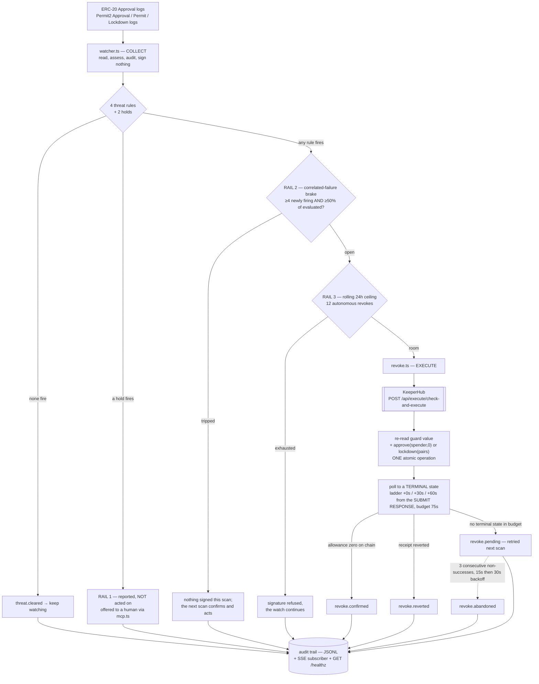
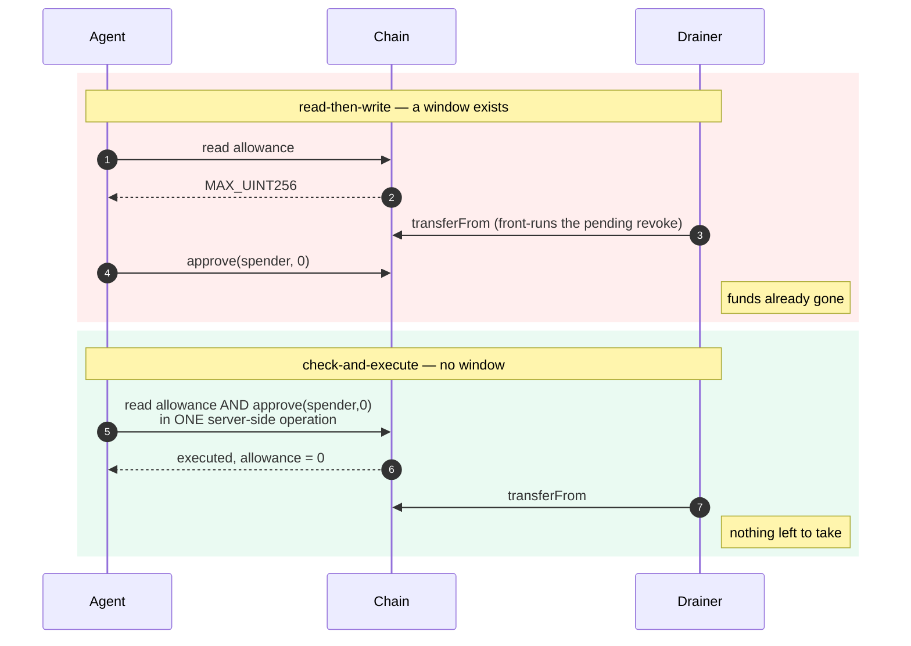

# Architecture

Revoker is a security agent with one job: notice that a token approval has
turned dangerous on a wallet nobody is watching, and take it away.

## Who this is for, and why the architecture says so

The design follows from a constraint that most of this product category quietly
ignores.

`approve(spender, 0)` clears the allowance of **`msg.sender`** and nobody
else's. KeeperHub signs exclusively for the organisation's Turnkey account.
Therefore the watched wallet and the revoke sender are **necessarily the same
account** — Revoker can only protect a wallet its signer already controls.

That rules out the retail drain victim entirely. It rules *in* the wallets that
are already programmatically custodied and have no human attached: trading bots,
liquidation keepers, rebalancers, cross-venue arbitrage signers, and DeFi
automation running on KeeperHub, Gelato, OpenZeppelin Relayer, Turnkey or
Fireblocks.

Those wallets are the right target for three architectural reasons, not just
marketing ones:

- **The constraint is satisfied by definition.** A keeper wallet is a
  programmatic signer. There is no "connect your wallet" step to design around,
  and no custody question to answer, because custody is the premise.
- **Approvals accumulate as sediment.** Every venue integration grants a router
  approval, usually unlimited because re-approving per trade costs gas forever.
  Nobody grants them deliberately and nobody audits them, which is why a
  *policy* engine beats a dashboard: there is no human in the loop to alert.
- **The revoke has to be defensible after the fact.** A keeper sits behind a
  risk committee. So every decision here is deterministic and carries its
  evidence into a durable trail — no model, no score, no sampling temperature.

**Detection is a commodity; response is not.** Approval scanners and wallet
trust scores already exist, including on KeeperHub's own marketplace
(`token-approval-risk-scanner-*`, `wallet-trust-score-*`). They tell you an
approval is risky. None of them act, and an alert that arrives at 3am for a
wallet with no human attached is an alert nobody will ever read.

---

## The loop

Every scan runs in three phases — **collect, gate, execute** — and each of the
last two can refuse the first. [`src/watcher.ts`](./src/watcher.ts) is the loop;
[`src/rules.ts`](./src/rules.ts) decides; [`src/revoke.ts`](./src/revoke.ts) is
the only module that writes.



Reads go straight to an RPC; writes go exclusively through KeeperHub. That split
is deliberate: the watcher polls continuously and a round trip through an
execution API would add latency to the one number that matters.

Be precise about what that costs, because an earlier version of this page was
not. The threat **decision is made entirely from local reads** —
`readAllowance`, `readBalance`, `readChainTimeSeconds` and `hasCodeAt` in
[`src/chain.ts`](./src/chain.ts) are what `assess()` evaluates, and no rule is
re-run anywhere else. What `check-and-execute` re-reads server-side is one thing
only: whether the allowance is **still live at signing time**. That single
re-read is not a second opinion on the policy; it is what closes the write-side
TOCTOU window, and claiming more for it than that would be claiming a
verification step this system does not perform.

---

## The one decision that matters

The revoke uses `check-and-execute`, not a read followed by a write. Both revoke
paths are in [`src/revoke.ts`](./src/revoke.ts).



A read-then-write agent decides at time T and acts at time T+n. That window is
exactly what a drainer watching the mempool needs — it sees the pending revoke
and front-runs it with a `transferFrom`. Closing the window is the difference
between a security agent and a script that usually wins.

This is *not* a claim that Revoker beats an attacker to the mempool. It does not
try to. The product bet is on the precondition — an allowance that is already
zero has nothing to exploit — and this section is only about not re-opening a
race inside our own write path.

The server-side re-read is real, and it is the load-bearing part: the value the
condition is scored against is whatever the chain holds when KeeperHub evaluates
it, not a number this process passed in. `check-and-execute` returns that
observation as `condition.observedValue`, and
[`src/revoke.ts`](./src/revoke.ts) carries it onto the outcome as
`observedAllowance`.

One correction we owe the reader: an earlier version of this page quoted a
specific `observedValue` — the full `MAX_UINT256` — as KeeperHub's observation
on the reference run. Nothing in this repo backs that particular number.
`revoke.confirmed` does not emit an `observed` field at all; only
`revoke.skipped` does, on the path where the condition found the slot already
zero. So the published trail in [`data/demo-run.jsonl`](./data/demo-run.jsonl)
carries no `observed*` key, and it never could have. The mechanism stands; the
digits were decoration, and on the one document whose subject is honest
accounting that is the worse of the two errors.

---

## Two approval surfaces, two revoke primitives

| Surface | Detection | Revoke | Batching |
|---|---|---|---|
| ERC-20 allowance mapping | token's own `Approval` logs | `approve(spender, 0)` | one tx per exposure |
| Permit2 allowance ledger | Permit2's `Approval` / `Permit` / `Lockdown` logs | `lockdown([(token, spender), …])` | **N slots, one tx** |

Permit2 matters because it is the surface an ERC-20 watcher is *structurally*
blind to. A signature-based grant writes Permit2's own
`allowance[owner][token][spender]` slot without the token contract being
touched, so the token emits nothing — no `Approval`, no state change in its own
mapping. The grant appears on chain inside the attacker's transaction, with no
wallet prompt that ever named an allowance.

The detection shape is inverted, which is why this is not a two-line addition:
ERC-20 logs are filtered *by token address* with the spender in the topics;
Permit2 logs are filtered by *the single canonical Permit2 address* with the
token as a topic. Three separate queries rather than one, because `Lockdown`
indexes only `owner` and cannot ride the same topic filter as `Approval` and
`Permit` — splitting them keeps the `owner` filter server-side on all three,
which is what stops it downloading every Permit2 log on the chain.

Three semantics that differ from ERC-20 and are each pinned by tests:

- **Unlimited is `type(uint160).max`,** not `type(uint256).max`. The amount is
  packed into 160 bits. Comparing against `MAX_UINT256` would score every
  unlimited Permit2 grant as bounded and quietly clear it.
- **Expiry is compared against chain time,** never host time, using the same
  strict `>` that `AllowanceTransfer` uses — so an allowance is still live on
  the expiration second itself. A `>=` would declare it dead one second early,
  and "dead" means we stop watching it.
- **An expired allowance is not an exposure.** Permit2 reverts the transfer, so
  `lockdown()` there would burn gas zeroing a number nobody can use.

---

## The Permit2 guard detour — a real platform limit, worked around without loss

`check-and-execute`'s condition schema is exactly `{operator, value}`. There is
no output index, no tuple path, no member selector.

`Permit2.allowance()` returns `(uint160 amount, uint48 expiration, uint48
nonce)`. Guarding on it therefore does not read the wrong member — there is **no
scalar to compare at all**. The evaluator reported `observedValue: undefined`,
scored `gt 0` as false, and **silently skipped the write**, logging a tidy
`revoke.skipped … reason=guard slot already zero` while leaving an armed,
unlimited, correctly-detected grant fully live.

Mocked tests passed. A dry-run simulation passed. Only a real transaction found
it. A guard that silently declines to fire is worse than no guard, because it
reads as success.

The fix keeps atomicity intact.
[`contracts/src/Permit2AllowanceView.sol`](./contracts/src/Permit2AllowanceView.sol)
is a 723-byte, ownerless, storageless, non-payable view contract whose
`liveAmountOf()` flattens the tuple to one `uint160` **and folds in the expiry
check**, so the server-side re-read agrees with the watcher rather than being
laxer than it. Permit2's address is a compile-time constant, so the helper can
never be re-pointed at an attacker's contract to fake a live allowance and bait
a revoke. Its own tests are in
[`contracts/test/Permit2AllowanceView.t.sol`](./contracts/test/Permit2AllowanceView.t.sol);
[`scripts/deploy-view.ts`](./scripts/deploy-view.ts) deploys it and deliberately
calls no KeeperHub endpoint, so the helper owes nothing to the org.

It is still **one** `check-and-execute`:

```
check   →  Permit2AllowanceView.liveAmountOf(owner, token, spender)   gt 0
action  →  Permit2.lockdown([(token, spender), …])
```

Only *which view function is read* changed — never *when*.
[`src/permit2.ts`](./src/permit2.ts) resolves the helper's address at revoke time
(not import time, so a missing entry takes down only the Permit2 path) and
**throws rather than returning undefined**, so no caller can treat "not
deployed" as "guard not needed". `revokePermit2Allowances` catches that throw and
returns a `failed` outcome without submitting anything — see the failure-mode
table below for the exact shape. A guardless lockdown would land, and would trade
away the single property this project sells.

---

## Threat rules

Four concrete, auditable rules and **two** holds, all in
[`src/rules.ts`](./src/rules.ts). Every firing carries the evidence that produced
it into the audit trail.

| Rule | Fires when | Source |
|---|---|---|
| `unlimited-to-unverified` | `MAX_UINT256` allowance to a contract whose source is unreadable | KeeperHub ABI resolution ([`src/keeperhub.ts`](./src/keeperhub.ts)) |
| `young-spender` | spender deployed < 7 days ago | `eth_getCode` + binary search ([`src/chain.ts`](./src/chain.ts)) |
| `denylisted` | spender is on the known-bad list | [`data/denylist.json`](./data/denylist.json) |
| `permit2-long-lived` | Permit2 grant valid > 30 days out, unverified spender | Permit2 `allowance()` + chain time ([`src/permit2.ts`](./src/permit2.ts)) |

**Any one rule firing is sufficient.** These are independent signals of
different kinds, not weighted terms in a score. Requiring consensus would mean
ignoring a confirmed deny-list hit because the contract happened to be verified
and old.

30 days is not a taste call: it is the expiration Uniswap's own interface writes
for a routine swap approval, so it is the ceiling of normal. A grant that
outlives it was either deliberately widened or signed blind.

Deliberately **not** an ML maliciousness classifier. An agent that moves funds on
an opaque score is not auditable, and *the model said so* is not a defence when
it is wrong. The cost of that choice is stated plainly: a spender that is
verified, aged, absent from the deny-list and not a long-lived Permit2 grant
trips nothing.

`young-spender` costs one `eth_getCode` in the common case — if code already
existed at the 7-day cutoff, the contract cannot be young and the rule stops
there. The binary search for exact age runs only on the rare firing path.

### Three answers, not two — and four places that abstain

Source verification has **three** answers, not two: `verified`, `unverified`, and
`unknown` — the last meaning the explorer did not answer. That distinction is
load-bearing, and it is enforced at the type level by `SourceVerification` in
[`src/keeperhub.ts`](./src/keeperhub.ts).

Collapsed into a boolean it read as "unverified". Because one endpoint
(`GET /api/chains/{id}/abi`) serves *every* spender, a single ABI-endpoint outage
made `unlimited-to-unverified` fire on **every** unlimited approval in the wallet
in the same scan. An unattended agent would have torn out every router it depends
on because a website was down.

So all four abstention sites — both rules that consult source verification,
`young-spender` on a non-archive RPC, and `permit2-long-lived` without chain time
— **fail closed through one shared constructor**: they return `INDETERMINATE`,
carry `indeterminate: true`, and name the remedy rather than reporting "safe".
One `indeterminate()` rather than four hand-written objects, because a fifth site
that quietly omitted the flag would be indistinguishable, in the trail, from a
rule that looked and found nothing.

`verificationOrAbstain()` is the type-level half of the guarantee: it returns
either `{verified: boolean}` or `{abstained: RuleVerdict}`, so a caller has **no
way to convert `unknown` into a firing verdict** — the boolean simply does not
exist on that branch.

A rule may fire only on a fact it observed. The failure of a detection input is
not a fact, and a threat rule that degrades into a rubber stamp is worse than one
that admits it cannot see.

### The hold channel — two holds

A hold is not a rule. It is the same shape and the same evidence discipline on a
**different list**, so it can neither create a threat nor mask one. The single
gate the autonomous loop asks is `mayRevokeUnattended()`, and a threat carrying a
hold is reported in full and left alone.

| Hold | Fires when | Why it is never unattended |
|---|---|---|
| `upstream-permit2-approval` | the spender **is Permit2 itself** | `approve(PERMIT2, 0)` breaks every DEX route for that token, wallet-wide |
| `operator-allowlisted` | the spender is in [`data/allowlist.json`](./data/allowlist.json) or `REVOKER_ALLOWLIST` | the operator has stated in advance that their strategy depends on it |

`upstream-permit2-approval` fires when the spender **is Permit2 itself**. That
ERC-20 approval is the upstream root of every Permit2 allowance for the token:
Permit2 can only move what the token has approved it to move.

- Downstream `lockdown()` is a **scalpel** — it zeroes exactly the slots that
  fired, costs one transaction, and nothing else in the wallet notices.
- Upstream `approve(PERMIT2, 0)` is an **amputation** — it breaks Uniswap, every
  router, and every dapp that routes that token through Permit2, silently, at
  the next swap, for a wallet whose owner is asleep and did not ask for it.

It is also the one approval most likely to be both unlimited and long-forgotten,
which is exactly what makes an automated agent likely to reach for it:
`unlimited-to-unverified` would fire on it the moment an explorer lookup blips.
So it is reported with its own identity, never revoked autonomously, and offered
to a human through the [MCP surface](./src/mcp.ts) where `confirm: true` is a
person saying yes.

**`operator-allowlisted` exists because of what the rules actually key on.**
`young-spender` fires on any contract deployed in the last seven days —
integrating a brand-new venue at launch is the single most normal thing a trading
agent does. `unlimited-to-unverified` fires on any unlimited approval whose
spender the explorer has not indexed yet, which is every router for the first
hours of its life. Both are correct rules describing genuine risk, and both,
pointed at an agent wallet's own infrastructure, describe the wallet working as
intended.

The allow-list does **not** suppress detection, and that is the whole design. The
rules still run, the exposure is still assessed, the evidence is still on the
record, and it is still offerable to a human. It withholds exactly one thing: the
unattended signature. It is reported through the same hold channel rather than
filtered earlier in the pipeline because **a suppressed exposure and an absent
exposure look identical in a log**, and the difference between them is the entire
safety argument.

The tradeoff, plainly: an operator who blesses a spender that later turns hostile
has opted it out of autonomous protection. That is a decision they made
explicitly with the address in front of them, which is a categorically better
failure than an agent that quietly decided the same thing on their behalf.

Permit2 is on the shipped allow-list *as well as* being a structural hold. The
duplication is deliberate — the address that must never be autonomously revoked
should not depend on exactly one of two reasons staying correct.

---

## Three rails, and why the scan had to be taken apart to get the second one

A hold refuses one exposure. Two failure shapes are not per-exposure at all, so
[`src/watcher.ts`](./src/watcher.ts) carries three refusal rails, and only the
first is in [`src/rules.ts`](./src/rules.ts).

| Rail | Scope | What it refuses | What it does *not* do |
|---|---|---|---|
| holds | one exposure | the signature for that pair | stop detection, reporting or the human path |
| correlated-failure brake | one whole scan | every signature this scan | refuse forever — the next scan decides |
| revoke-rate ceiling | rolling 24h | further signatures until the window rolls | stop the watch |

### Rail 2 — the correlated-failure brake

Even with every rule abstaining correctly on a *failed* lookup, there is a class
of fault the loop cannot enumerate in advance: a shared input that starts
answering **wrongly** rather than not at all. An explorer returning bad data, a
deny-list feed shipping a corrupt update, an RPC serving another chain's state.
Any of them flips many exposures from quiet to threatening in the same instant,
and each individual rule fires correctly on what it was told.

The prior is what decides this. For N unrelated `(token, spender)` grants to
become genuinely hostile between two five-second polls, an attacker must have
compromised N independent counterparties simultaneously. For the same N to light
up because one shared input misbehaved, **one** thing has to go wrong. The cost of
being wrong is asymmetric in the same direction: waiting one poll interval costs
seconds, while acting on a false mass detection costs the wallet every approval
it depends on, irreversibly.

So: **≥ 4 newly-firing exposures that are also ≥ 50% of everything the rules
evaluated this scan** → sign nothing, say so loudly in the trail, and let the
next scan decide.

Both conditions, not either. The absolute floor exists because a fraction alone
is nonsense at small N — one new drainer in a two-approval wallet is 50% of it,
and is exactly the case this product exists for. The fraction exists because the
floor alone would brake a busy wallet that legitimately found four bad spenders
among sixty. Together they describe the only shape that is actually suspicious:
*most of what we can see changed its answer at once.* The demo wallet holds two
exposures and therefore can never trip it.

It is a **one-scan delay, not a refusal.** The candidate set is recorded before
the decision and unconditionally, so whatever fired now is no longer "newly"
firing next time. A genuine mass compromise is still there five seconds later and
is acted on then; an infrastructure blip has cleared and there was never anything
to revoke.

It runs **once per scan across both surfaces**, not per surface, because the
shared inputs it defends against are shared across both — a fault that split its
blast radius evenly between ERC-20 and Permit2 would otherwise slip under each
half's threshold.

### Why the old loop could not express it

The scan used to revoke **inline, mid-iteration**. That made this rail
structurally impossible to write: by the time the loop knew how many exposures
had fired, it had already revoked the first of them. A brake that can only be
applied after the damage is not a brake.

So `scan()` was taken apart into three phases:

```
COLLECT   read every exposure on both surfaces, run the rules, write the full
          audit trail — threats, clears, holds — and sign nothing
GATE      the correlated-failure brake, once, over both surfaces' candidates
EXECUTE   sign, under the ceiling, in the order the exposures were found
```

Writing the detection record *before* any rail can refuse is the point of the
split, not a side effect: **an agent that is refusing to act must still be able to
say what it saw**, or its refusal is indistinguishable from blindness. The cost is
one extra round of assessment latency before the *first* revoke of a
multi-exposure scan, and nothing at all for the last.

### Rail 3 — the rolling 24h ceiling, and why it is not `maxRevokes`

A hard cap of **12 autonomous revokes per rolling 24 hours**
(`REVOKER_MAX_REVOKES_PER_DAY`), bounding blast radius whatever the rules
believe. Rolling rather than per-calendar-day because a daily reset is a cliff an
attacker can straddle: spend the budget at 23:59, spend it again at 00:01, and
the "daily" cap has authorised twice its number in two minutes.

It meters **submitted** revokes, not successful ones. A revoke that reverts still
signed a transaction, still spent gas, and still counts against a rail whose job
is to bound how much this process may do to the wallet.

`maxRevokes` is a different thing and is deliberately **not** promoted into a
safety rail. It is terminal: it calls `stop()` and the process stops watching. It
exists as a harness affordance — the benchmark uses it to bound a run — and
nothing more. **An agent that stops watching is not a safer agent, it is an absent
one.** The ceiling refuses *signatures* while detection, assessment, the audit
trail and the human MCP path all carry on, which is the entire difference between
a safety rail and an off switch. In the ERC-20 loop that difference is one
keyword: `continue`, not `break`.

On the Permit2 side the ceiling **trims the batch** rather than refusing it. A
`lockdown()` of six slots is one transaction but six revokes, and metering it as
one would let the batched surface walk straight through a rail the ERC-20 surface
obeys. The slots that do not fit are still tracked, still reported, and are the
first candidates next scan.

---

## Landing the transaction, not just submitting it

`check-and-execute` exposes **no fee override** — only `gasLimitMultiplier`. So
we do not get to name a tip. That is a property of the guarded path
specifically: KeeperHub's `execute_contract_call` schema carries a
`priority_fee_gwei`, and `execute_check_and_execute` does not. The only path
without a TOCTOU window is the only path without tip control, and we take that
trade every time.

```
rung 0   t=0s     first submission,  gasLimitMultiplier 1.2
rung 1   t=+30s   resubmit,          gasLimitMultiplier 1.5
rung 2   t=+60s   resubmit,          gasLimitMultiplier 2.0
give up  t=+75s   report "pending" — explicitly NOT "failed"
```

### Two clocks, and which number uses which

That `t` is **not** measured from detection. `awaitLanding()` starts its clock
when the submit call *returns* — it is only reached after `checkAndExecute()`
has resolved — so every rung offset, and the 75s budget, is measured **from the
submit response**.

`latencyMs`, the headline number, uses the other clock entirely: it starts at
`detectedAt`, the moment the rules fired in the collect phase, and ends when the
chain confirms the allowance is zero. That is the figure
[BENCHMARK.md](./BENCHMARK.md) reports as `response`.

Presenting the two as one clock would understate where the rungs actually land.
The measured detect→confirmed cycle is **p50 13.47s, p95 25.17s, max 26.55s over
25 live cycles**, and the submit round trip sits inside that span — so a rung
nominally at `t=+30s` lands meaningfully later than 30s after detection in
wall-clock terms. Both statements are true; only saying which clock each uses
makes them consistent.

| Number | Clock starts at | Where it lives |
|---|---|---|
| rung offsets `+0s / +30s / +60s`, budget `+75s` | the **submit response** | `ESCALATE_AFTER_MS`, `LANDING_BUDGET_MS` in [`src/revoke.ts`](./src/revoke.ts) |
| `latencyMs` / BENCHMARK `response` | **detection** (`detectedAt`) | `RevokeOutcome.latencyMs` |
| BENCHMARK `exposure` | the threat going live **on chain** | [`scripts/bench.ts`](./scripts/bench.ts) |

30s is two and a half blocks, and sits **above** the slowest healthy response we
have measured: p95 **25.17s**, max **26.55s** over 25 live cycles
([BENCHMARK.md](./BENCHMARK.md)). The rung used to be 24s — *below* both, and
below the p95 — so more than 5% of perfectly healthy executions tripped the
ladder and paid for a rung they never needed. It was raised to 30s to sit above
the observed maximum rather than on the p95, because a first rung placed at the
p95 is by construction a rung that fires on one healthy execution in twenty.

### What the ladder is, and what it is not

An earlier version of this document claimed **"the resubmission IS the fee
bump"**. That is only true if KeeperHub *replaces* the stranded transaction at
the **same nonce**. If a resubmission gets a fresh nonce instead, rung 1 queues
*behind* rung 0 and structurally cannot be mined first — it bumps nothing.

**KeeperHub does not document which of the two it does**, so we no longer claim
it. The whole published corpus says exactly one thing about nonces — an FAQ line
listing "transaction retries, nonce management" among its production features —
and the direct-execution API reference does not mention a nonce anywhere: no
request field, no response field, nothing on the status endpoint. The live MCP
schemas match: a caller can neither name a nonce nor ask which one an execution
used. Each rung is a separate `check-and-execute` under its own idempotency key,
so each is a separate execution record, and nothing states that KeeperHub folds
them into one nonce slot.

What the ladder provably buys, assuming nothing at all about nonce handling:

| | |
|---|---|
| **A wider gas limit** per retry (1.2 → 1.5 → 2.0) | a fee market that moves under a late inclusion cannot *also* turn it into an out-of-gas revert |
| **A second guarded attempt**, re-priced by KeeperHub's oracle against the base fee current at that moment | if the retry does get an independent nonce, this is the attempt that can land on its own |
| **A loser that costs nothing**, when the winner lands first | the server-side `allowance > 0` condition is evaluated *before signing*, so a rung submitted after the allowance is already zero writes nothing and spends nothing |

The honest worst case, stated rather than hidden: if two rungs' conditions are
*both* evaluated while the allowance is still non-zero, both submit, and the
second is a no-op `approve(spender, 0)` that still pays its base gas. That is
bounded by the two rungs above, and it is the price of not having a tip to name.

The agent polls to a **terminal state** and reports four dispositions:

| Disposition | Audit stage | Means |
|---|---|---|
| `confirmed` | `revoke.confirmed` | receipt succeeded **and** the chain confirms the allowance is zero |
| `reverted` | `revoke.reverted` | the transaction landed and reverted — a fact, not an absence |
| `failed` | `revoke.failed` | the execution API reported a terminal failure |
| `pending` | `revoke.pending` | no terminal state inside the 75s budget — still possibly on its way |

A merely-pending execution used to be reported as `failed`. It is not the same
thing, and a sentinel that cries failure at a transaction still in flight trains
its operator to ignore it. `revoke.pending` is its own audit stage for exactly
that reason: written as `revoke.failed` with a `disposition` field, it was
counted by the dashboard's failure tile and captioned "revoke failed" on the
row, which contradicted this page on the one screen anybody actually looks at.
It is excluded from the dashboard's failure set and has its own tile.

### Every audit stage, and what each one is for

The trail ([`src/audit.ts`](./src/audit.ts), JSONL plus an SSE subscriber) has
one stage per distinguishable thing that can happen. Four of them are recent, and
each exists because its absence made a real failure look like something else.

| Stage | Written by | Exists because |
|---|---|---|
| `watch.start` / `watch.scan` | [`src/watcher.ts`](./src/watcher.ts) | the cadence `/healthz` measures staleness against |
| `watch.error` | [`src/watcher.ts`](./src/watcher.ts) | **new.** Scan failures used to be filed as `revoke.failed` with a `stage` detail key that clobbered the envelope, so a scan that never attempted a revoke inflated the dashboard's failure count |
| `threat.detected` / `threat.cleared` | [`src/watcher.ts`](./src/watcher.ts) | the evidence a revoke has to be justifiable by, later |
| `revoke.submit` | [`src/revoke.ts`](./src/revoke.ts) | written **after** the call returns, so it can name KeeperHub's `executionId`; an escalation rung also carries `replaces` |
| `revoke.skipped` | both | four distinct refusals share it, separated by a `rail` field: `hold`, `correlated-failure-brake`, `revoke-rate-ceiling`, and the condition finding the slot already zero |
| `revoke.confirmed` | [`src/revoke.ts`](./src/revoke.ts) | the chain — not the execution report — says the allowance is gone |
| `revoke.reverted` | [`src/revoke.ts`](./src/revoke.ts) | **new.** It landed and failed. That is a fact with a revert reason attached, and it is not the same event as never landing |
| `revoke.pending` | [`src/revoke.ts`](./src/revoke.ts) | **new.** The budget expired while the execution was still in flight. Filed as `revoke.failed`, it was counted in the dashboard's failure tile and captioned "revoke failed" — contradicting this page on the one screen a judge looks at |
| `revoke.failed` | [`src/revoke.ts`](./src/revoke.ts) | a terminal failure, or a reported success with a surviving allowance |
| `revoke.abandoned` | [`src/watcher.ts`](./src/watcher.ts) | **new.** The agent has stopped defending this exposure. Emitted **once**, not every scan that then declines to retry |

### `executionId` — and the gap it has not closed yet

Every `revoke.*` stage now carries KeeperHub's `executionId`. A transaction hash
proves only that *something* landed; it cannot show that the write went through a
**guarded** `check-and-execute` with its condition evaluated server-side before
signing. Read from the chain alone, "executed via KeeperHub" is an inference from
a `from` address. The `executionId` is what turns it into a lookup.

It is hoisted above the `try` in both revoke paths deliberately, so the `catch`
can still name the execution that was in flight — *"we submitted `exec-…` and
then lost contact"* is a materially different incident from *"the submission
never left"*. And on an escalation it names the **rung that actually reached the
verdict**, not the submission we started polling, because after a rung replaces
the original the original names a record that no longer decides anything.

The honest gap: **the published trail carries none.** Both reference runs — the
ERC-20 headline and the Permit2 `lockdown()` — predate the field, so
[`data/demo-run.jsonl`](./data/demo-run.jsonl) has zero `executionId` values.
Back-filling one would mean inventing an identifier on the single artifact whose
entire purpose is being trustworthy after the fact. The plumbing is tested on
both paths and populates from the next live revoke onward; until one is re-run,
this paragraph is the note saying so.

---

## Failure modes

Reliability is a judged criterion, but more to the point, an agent whose whole
premise is *still watching at 3am* has to survive the night.

| Failure | Behaviour | Audit stage |
|---|---|---|
| Whole scan throws (RPC or API error) | loop continues — a transient failure must not kill the watcher. No token or spender on the entry, which is what distinguishes it from the per-exposure case below | `watch.error` |
| One hostile token reverts on `allowance()` | isolated per exposure; the rest of the scan completes. Before this, a single bad token silently ended every later evaluation, on that cycle and all future ones | `watch.error` (with token + spender) |
| The Permit2 surface is unreachable | caught separately so an unreachable Permit2 index cannot discard the ERC-20 sweep that had just finished | `watch.error` (`surface: permit2`) |
| KeeperHub 429 / 5xx | exponential backoff with jitter, honouring `Retry-After`, up to 4 retries (5 requests total) | — |
| KeeperHub 4xx | **not** retried — a bad request stays bad, and replaying a write risks double-execution | — |
| Rate limit approached | client-side pacing at 60 req/min, before the server has to reject | — |
| Revoke reports success but allowance is non-zero | retried next scan | `revoke.failed` |
| Transaction landed and reverted | distinguished from never landing; the only case carrying a revert reason | `revoke.reverted` |
| No terminal state within the 75s budget | retried next scan, **never** reported as failed and never counted as one | `revoke.pending` |
| Three consecutive non-successes on one exposure | the attempt count and the last error; the exposure leaves the retry rotation until the chain shows a zero or records a new grant | `revoke.abandoned` |
| Allowance already zero at execution time | the server-side condition fails, no transaction, no gas — and it is **not** charged as an attempt | `revoke.skipped` |
| A hold fired on the exposure | detected, assessed and reported in full; only the unattended signature is withheld | `revoke.skipped` (`rail: hold`) |
| ≥4 newly-firing exposures and ≥50% of those evaluated | nothing is signed this scan; the next scan re-reads all of them and acts on whatever still fires | `revoke.skipped` (`rail: correlated-failure-brake`) |
| The rolling 24h ceiling is exhausted | signatures refused, said **once** per scan rather than once per exposure; the watch continues | `revoke.skipped` (`rail: revoke-rate-ceiling`) |
| Source verification lookup fails | rules 1 and 4 return `INDETERMINATE`, never "unverified" and never "safe" | carried on `threat.cleared` evidence |
| Archive state unavailable | `young-spender` returns `INDETERMINATE`, never "safe" | carried on `threat.cleared` evidence |
| Chain time unavailable | `permit2-long-lived` returns `INDETERMINATE` rather than measuring a lifetime against the host clock | carried on `threat.cleared` evidence |
| Permit2 guard helper not deployed | the resolver throws, `revokePermit2Allowances` catches it and returns `{executed: false, disposition: 'failed', error}` **without submitting anything**. The refusal is real; nothing propagates out to the watcher, which charges it as one failed attempt like any other | `revoke.failed` |
| No scan within 3× the poll interval | `GET /healthz` answers **503** | — |
| Audit write fails | swallowed — losing a log is bad, failing to revoke because of it is worse | — |

An exposure is marked handled **only** once the chain confirms the allowance is
zero, so a failed revoke is retried rather than silently dropped. The dedupe
entry is dropped on an **observed** on-chain zero, which is what lets a later
re-grant to the same spender be treated as a fresh exposure — before that fix, a
re-granted approval was invisible for the life of the process.

### Retries are bounded, and giving up is an event

"Retried rather than silently dropped" used to mean *retried forever*: no
attempt counter, no backoff, no give-up. A token whose `approve()` accepts the
call and silently ignores it therefore produced **one new gas-spending
transaction every poll interval, indefinitely** — and every individual attempt
looked like a healthy first attempt, so nothing in the trail ever said the agent
was stuck.

Both surfaces now share one attempt ledger:

- **3 consecutive non-successes** per exposure, spaced by an exponential backoff
  (15s, then 30s) that is several poll intervals wide on purpose.
- Then `revoke.abandoned`, emitted **once**, carrying the attempt count and the
  last error, and surfaced as its own tile on `/verify`. Nothing else on that
  page can say "the agent has stopped defending this".
- The budget is released only on a **positive fact about the chain**: an
  observed zero allowance (or an empty/expired Permit2 slot), or a *new* grant.
  For ERC-20 a new grant is an `Approval` log from a block higher than any seen
  before — a high-water mark, because the sliding log window re-delivers the
  same log every scan and resetting on mere presence would restore the unbounded
  loop under a new name. For Permit2 it is a strictly greater `(nonce,
  expiration)` read off the slot, since `fetchPermit2Pairs` deliberately returns
  pairs rather than log values.
- A revoke that was **never submitted** — the server-side condition found the
  allowance already zero — is not charged as an attempt. It cost no gas, and on
  the Permit2 path one stale *guard* slot skips the whole batch, so charging it
  would abandon the live slots queued behind it.

---

## Surfaces, and the boundary between them

Three surfaces answer three different users, and the boundaries are structural
rather than conventional.

| Surface | User | Property that is enforced in code |
|---|---|---|
| [`src/watcher.ts`](./src/watcher.ts) — the autonomous loop | nobody; it runs unattended | **imports no model.** Nothing in it reaches `mcp.ts` |
| [`src/mcp.ts`](./src/mcp.ts) — MCP over stdio | a human investigating, or the assistant beside them | 3 of 4 tools are pure reads; `revoke_approval` refuses without `confirm: true` |
| [`src/server.ts`](./src/server.ts) — `/verify`, `POST /revoke`, `GET /healthz` | an operator, a judge, an uptime probe | the callback is `503` unconfigured and `404` in demo mode; `/healthz` is `503` on a stale scan |
| [`scripts/kh-cli.ts`](./scripts/kh-cli.ts) — the real `kh` binary | an operator at a terminal | used only for arming; nothing in `src/` imports it |

The MCP surface is a **query surface, not a decision-maker.** The autonomous
loop gains no model from it. That separation is why the agent's revokes stay
reproducible: the same chain state always produces the same decision, and the
reason survives being read back a month later.

The CLI is there because arming an approval is genuinely CLI-shaped — it must be
signed by the Turnkey account and it is an *operator* action, not the agent's.
[`scripts/kh-cli.ts`](./scripts/kh-cli.ts) runs `kh execute contract-call` then
`kh execute status` (two commands rather than one `--wait`, mirroring the REST
path exactly). It is a pure `kh` wrapper and holds no REST client at all: when
the binary is absent, `khVersion()` returns `null` and **the caller chooses**.
[`scripts/seed.ts`](./scripts/seed.ts) is that caller, and the fallback lives
there — it branches on the null and arms over
[`src/keeperhub.ts`](./src/keeperhub.ts) instead, so the CLI is a real path and
never a hard dependency. An earlier version of this page put the fallback inside
`kh-cli.ts`, which is the wrong file: nothing there can reach the REST client
without importing the agent into the operator wrapper. `make arm` is that flow
written out, ending in an independent `kh read` that is free to disagree with the
seed's own report.

### `GET /healthz` — because a stopped watcher looks exactly like a running one

A watcher that has silently stopped inside a live HTTP server is indistinguishable
from a healthy one from the outside. The page still renders, `/api/stream` still
opens, and `/api/meta` still answers — but `/api/meta` is static configuration
(wallet, network, mode) and says nothing about whether a scan has happened in the
last hour. `/healthz` is the only surface that answers the question an operator or
a container probe actually has.

It is `ok` only when **both** facts hold: this process constructed a `Watcher`,
*and* a `watch.scan` has been written within **3 × the poll interval**. Two
separate facts, because "a watcher exists" and "a watcher is making progress" are
different claims and only the pair is health.

- **`503`, not a `200` carrying `ok: false`.** The consumers that matter — a
  container probe, an uptime monitor, `curl -f` — read the status line and never
  the body.
- The counters ride the **same audit subscriber the dashboard uses**, so "a scan
  happened" has exactly one definition and `/healthz` can never disagree with the
  tiles on `/verify`.
- The staleness clock uses the entry's **own timestamp**, not `Date.now()`, so a
  replay of yesterday's recording cannot make a process that has never scanned
  report itself freshly healthy.
- `revoke.pending` is deliberately absent from `revokesFailed`. Counting it there
  would put the contradiction the dashboard just stopped making back into the
  machine-readable surface.

The port is `PORT` (default 3000) and a busy one is **fatal** rather than silently
relocated: the README's `localhost:3000/verify` instruction would otherwise be
quietly wrong, and the likeliest thing already holding the port is another
Revoker — two watchers racing to send the same `approve(spender, 0)` on one
wallet. The error message names `PORT=3001 pnpm demo:verify` as the way out.

### `src/lists.ts` — one parser, because two silently disagreeing is worse

The watchlist and deny-list loaders were byte-identical copies in
[`src/index.ts`](./src/index.ts) and [`src/server.ts`](./src/server.ts). That is
not a style complaint. The watchlist is keyed by chain id and the deny-list is
not, so the files have genuinely different shapes, and a fix applied to one copy
— a new key, an address normalisation — leaves the *other agent entry point*
reading the file the old way. The failure that buys is the worst one available
here: **the dashboard and the unattended watcher disagreeing about which spenders
are denied, with neither of them wrong on its own terms.** One definition, in
[`src/lists.ts`](./src/lists.ts), imported by both.

Every loader there degrades to an **empty list rather than throwing**, which is
deliberate in the same direction as everything else on this page. These files are
hand-edited by an operator, and a stray comma at 3am must not take down a running
sentinel. An empty watchlist means the scan finds nothing; a throw means the agent
is not watching at all and nobody is told. Both are bad — only one leaves the
process alive to report itself through `/healthz`.

(The operator allow-list is loaded separately, by `loadAllowlist()` in
[`src/config.ts`](./src/config.ts), because it rides the credential chain:
`REVOKER_ALLOWLIST` adds to [`data/allowlist.json`](./data/allowlist.json)
without editing the file.)

### The workflow, and its real status

[`workflows/revoker-sentinel.json`](./workflows/revoker-sentinel.json) is the
detection half: event trigger → filter for unlimited-and-ours → `POST /revoke`
callback into the agent → branch on the reported disposition → alert.
**The write never moves into the workflow.** The
callback asks the agent to revoke, and the agent still performs it as a single
server-side `check-and-execute`, so the round trip cannot re-open the TOCTOU
window — the read and the write remain inside one KeeperHub operation that
happens strictly after the call.

**Status: authored and pre-flight validated, NOT deployed.** Pre-flight passes
(6 nodes, 5 edges). Creation returns `402 upgrade_required` —
`action.http-request` requires a Pro plan. There is no live workflow. See
[platform findings](./README.md#platform-findings) in the README, and
[`scripts/deploy-workflow.ts`](./scripts/deploy-workflow.ts) for the deploy path
that stays in the repo.

The callback fails closed: `POST /revoke` answers `503` when
`REVOKER_CALLBACK_SECRET` is unset, and is a plain `404` in any dry-run or demo
mode — absent rather than merely disabled.

---

## Why KeeperHub is the engine, not decoration

Remove KeeperHub and Revoker needs seven separate systems: a transaction
relayer, a congestion-aware gas oracle with backoff, an MEV-protected submission
route, a status and confirmation poller, an action-discovery layer, an ABI
resolution service, and an audit-log pipeline — plus a custody solution.

The custody point is the sharpest one. KeeperHub signs through a Turnkey
enclave, so **this process never holds a private key**. An autonomous agent with
a hot key that can move funds is a liability; one that can only ask a
policy-bound signer to act is not. That property is also what forces the x402
refusal below — it is load-bearing, not a slogan.

Endpoints used:

| Endpoint | Used for |
|---|---|
| `POST /api/execute/check-and-execute` | the atomic revoke — `approve(spender,0)` and `lockdown()` ([`src/revoke.ts`](./src/revoke.ts)) |
| `POST /api/execute/contract-call` | arming approvals, contract writes, and `simulate: true` dry runs ([`src/mcp.ts`](./src/mcp.ts), [`scripts/seed.ts`](./scripts/seed.ts)) |
| `POST /api/execute/transfer` | native transfers |
| `GET /api/execute/{id}/status` | terminal-state polling, gas, sponsorship, audit record |
| `GET /api/chains` | network + explorer resolution |
| `GET /api/chains/{id}/abi` | **source-verification signal for rules 1 and 4** ([`src/rules.ts`](./src/rules.ts)) |
| `GET /api/user/wallet` | signer identity assertion ([`scripts/spike.ts`](./scripts/spike.ts)) |
| `GET /api/user/wallet/balances` | token discovery (curated registry) |
| `GET /api/workflows` | find an existing sentinel by name |
| `POST /api/workflows/create` | create the sentinel (blocked by the 402) |
| `PATCH /api/workflows/{id}` | update it in place rather than making a second copy |

Plus `Idempotency-Key`, `gasLimitMultiplier`, and pacing on the
`X-Poll-Interval-Hint` response header. The client is
[`src/keeperhub.ts`](./src/keeperhub.ts).

### x402 and MPP, declined — with the correction the README already made

An earlier version of this page said the Turnkey signer **cannot** produce an
x402 authorization, and treated that as the load-bearing reason. That was too
strong, and the README
([KeeperHub Integration](./README.md#keeperhub-surfaces)) retracted it. The
narrower claim that survives checking: the **workflow-layer**
`web3/sign-typed-data` action does refuse "transfer authorizations", which is
exactly what an x402 `exact` payment is (an EIP-3009
`TransferWithAuthorization`) — but KeeperHub's **agentic wallet** signs them
keylessly through a Turnkey sub-organisation. So it is possible, not impossible.

What actually decided it is duller and true: the agentic wallet settles in
**Base / Tempo mainnet USDC**, so consuming a paid endpoint means funding a
mainnet wallet to demonstrate a Sepolia agent. Declined on cost and scope. The
demand is real rather than hypothetical — the CDP Bazaar lists 14,080 x402
resources, roughly 600 in the security category — so this is a decision made
against a live option, not an absence.

MPP is declined more simply: it is a metered payment protocol, and Revoker has
no counterparty and no billing period. Publishing a paid workflow would also need
the same Pro plan the `402` above already blocks. Wiring it in would be padding.

---

## Constraints discovered by building it

**Token discovery needs an explicit watchlist**
([`data/watchlist.json`](./data/watchlist.json)). No public RPC serves an
address-less `eth_getLogs` over a useful block range — publicnode requires an
address filter, 1rpc caps the range at 50 blocks. KeeperHub's balances endpoint
only covers a curated token registry and cannot see arbitrary tokens.
Production resolves this from an indexer; the MVP watches what it is told to
watch and says so.

**A restart rebuilds only from the last log window.** Within one run every pair
ever seen is tracked forever, so an approval never ages out of attention. Across
a restart the set is rebuilt from the ~16.6h window (5,000 blocks at 12s), so an
older grant stays invisible until another log for it appears. A durable cursor
closes this at the cost of a file format, its corruption cases and its own
tests; the honest boundary today is stated rather than hidden.

**The signer is the watched wallet, necessarily.** This is the constraint the
whole product is aimed at rather than a defect — see the opening section.
[`scripts/spike.ts`](./scripts/spike.ts) asserts the configured address matches
the one KeeperHub controls and fails loudly otherwise.

---

## Not built, and why

**GuardVault** — a per-user gas escrow was specced so the agent would be
economically self-sufficient. Its justification was that the Sepolia demo pays
its own gas. Measurement killed it: every execution came back `sponsored: true`
with the signer's balance byte-for-byte unchanged. Building an escrow for a cost
that did not materialise would have been ceremony, so it was cut rather than
shipped as decoration. Production gas economics still assume gas is a real cost,
because the sponsorship *policy* is undocumented.

**A model in the decision path.** Shipped as a query surface instead, for the
reasons in "Surfaces" above. The distinction is enforced by the import graph,
not by a comment.

---

## Where to read next

| Document | What it holds |
|---|---|
| [README.md](./README.md) | the pitch, the on-chain proof table, the platform findings, the test census |
| [DEMO.md](./DEMO.md) | reproduce every claim from a clean checkout, with expected output |
| [BENCHMARK.md](./BENCHMARK.md) | p50/p95 over N=25, per-cycle transaction links, the ladder these figures set |
| [`data/demo-run.jsonl`](./data/demo-run.jsonl) | the recorded run `pnpm demo:verify` replays |
| [`deployments.json`](./deployments.json) | contract addresses and deploy transactions |
