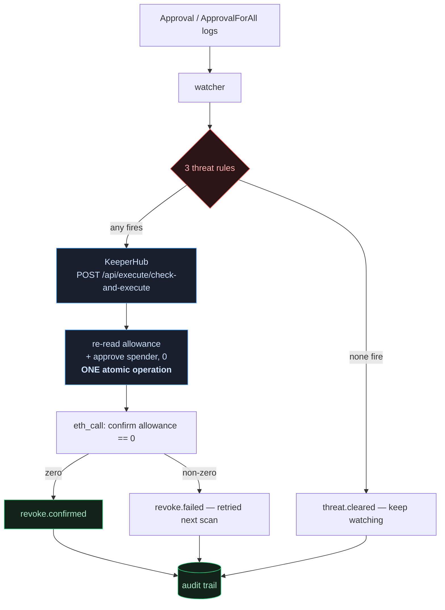

<div align="center">

  

  <h1>Revoker</h1>
  <p><em>The agent that lands the revoke before the drainer moves.</em></p>

  

  <p>
    We let the drain contract fire <strong>after</strong> the revoke.<br/>
    It succeeded, and it took <strong>zero</strong>.<br/>
    <a href="https://sepolia.etherscan.io/tx/0xe127f3d2e2eb20a9825fbec63c56028815ce145c8cdd9e143a02600e2da1a303">See the transaction</a>.
  </p>

  <br/>

  [](https://dorahacks.io/hackathon/agents-onchain)
  [](https://keeperhub.com)

  <br/>

  
  
  
  
  
  [](https://opensource.org/licenses/MIT)
  [](https://github.com/edycutjong/revoker/actions/workflows/ci.yml)

</div>

---

## 💡 The Problem & Solution

### The Problem

Token approvals are the most common wallet-drain vector. You grant
`approve(spender, MAX_UINT256)` once to try a new dApp, then forget it exists.
Months later the spender is compromised, upgraded maliciously, or was a scam all
along — and once the drain starts it is instant and irreversible.

The industry's answer to this is **read-only**: scanners and trust scores that
*tell you* an approval is risky. KeeperHub's own marketplace has
`token-approval-risk-scanner-*` and `wallet-trust-score-*`. None of them **act**.

**"Isn't this already solved?"** is the fair question, and the honest answer is
that prior art exists but takes a different shape.

The commercial attempt at automated wallet rescue — Harpie was the best-known,
and it shut down in March 2025 — worked by **racing the drainer**: watch the
mempool, and when a malicious `transferFrom` appears, front-run it and sweep the
assets somewhere safe. That approach has two costs. It is a gas auction you can
lose, and it requires the user to grant the rescue service its own token
approval. The anti-drain tool needed the exact primitive that causes the problem.

General automation platforms (OpenZeppelin's Defender lineage, now its
open-source Monitor and Relayer) can fire condition-triggered transactions, but
they are plumbing you assemble into a product — not an approval-threat agent.

Revoker takes the smaller, more reliable target: **remove the approval instead of
racing the transfer.** There is no auction to lose and no mempool to win, because
once the allowance is zero the attack has nothing to execute against. It is
open-source and non-custodial — signing happens inside a Turnkey enclave and this
process never holds a key, so you are not handing rescue rights to anyone — and
every decision carries its evidence into an auditable trail.

### The Solution

Revoker acts. It watches a wallet's live approval set and, the instant a concrete
threat condition fires, autonomously executes `approve(spender, 0)` through
KeeperHub — landing a real, linkable, state-changing transaction.

---

## 🏗️ Architecture & Tech Stack



The revoke goes through `check-and-execute` rather than a read followed by a
write. That matters: the allowance is re-read and the revoke fired inside the
same server-side operation, so a drainer cannot slip a `transferFrom` between our
check and our act. A check-then-act implementation has a race window; this
does not.

| Layer | Technology | Why |
|---|---|---|
| Execution + custody | **KeeperHub** | Signs via a Turnkey enclave — this process never holds a private key |
| Chain reads | viem + public RPC | The watcher polls continuously; an execution API round trip would add latency to the number that matters |
| Contracts | Solidity 0.8.28, Foundry | Dependency-free fixtures, so the demo reproduces with no package installs |
| Runtime | TypeScript strict, Node 22 | `noUncheckedIndexedAccess`, `verbatimModuleSyntax` |
| Dashboard | Node `http` + SSE, zero-dependency HTML | No CDN, no build step |
| Tests | Vitest + Foundry | 44 unit + 42 Solidity (100% contract coverage), weighted toward the negatives |

### Threat rules

| Rule | Fires when | Signal source |
|---|---|---|
| `unlimited-to-unverified` | `MAX_UINT256` allowance to a contract whose source is unreadable | KeeperHub ABI resolution |
| `young-spender` | spender contract deployed < 7 days ago | `eth_getCode`, binary search |
| `denylisted` | spender is on the known-bad list | `data/denylist.json` |

Any one rule firing is sufficient — these are independent signals of different
kinds, not weighted terms in a score. Requiring consensus would mean ignoring a
confirmed deny-list hit because the contract happened to be verified.

Every firing carries the evidence that produced it into the audit trail, so a
revoke can be justified after the fact. Deliberately not an ML "maliciousness
score": *the model said so* is not a defence when it is wrong.

---

## 🏆 KeeperHub Integration

Remove KeeperHub and Revoker needs seven separate systems: a transaction
relayer, a congestion-aware gas oracle with backoff, an MEV-protected submission
route, a status/confirmation poller, an action-discovery layer, an ABI
resolution service, and an audit-log pipeline — plus a custody solution.
KeeperHub signs through a Turnkey enclave, so this process never holds a private
key.

**10 distinct surfaces across 12 application call sites:**

| Surface | Used for | Where |
|---|---|---|
| `POST /api/execute/check-and-execute` | the atomic revoke | `src/revoke.ts` |
| `POST /api/execute/contract-call` | arming the demo approval, contract writes | `scripts/seed.ts`, `scripts/bench.ts` |
| `POST /api/execute/transfer` | native transfers | `scripts/spike.ts` |
| `GET /api/execute/{id}/status` | confirmation, gas, sponsorship, audit record | `src/revoke.ts` |
| `GET /api/chains` | network + explorer resolution | `scripts/spike.ts` |
| `GET /api/chains/{id}/abi` | **source-verification signal for threat rule 1** | `src/rules.ts` |
| `GET /api/user/wallet` | signer identity assertion | `scripts/spike.ts` |
| `GET /api/user/wallet/balances` | token discovery | `src/watcher.ts` |
| `simulate: true` | dry-run validation in the integration spike | `scripts/spike.ts` |
| `Idempotency-Key` | safe retries without double-execution | `src/keeperhub.ts` |

The ABI endpoint is worth calling out: it does not merely fetch ABIs here, it
**powers a threat rule**. Unverified source is not proof of malice, but it means
nobody can read what the code does — exactly the position a victim is in when
they grant an unlimited approval.

---

## ⛓️ Live Deployment

Every claim below links to a transaction anyone can verify.

### The headline: a real drain, really stopped

The full cycle, executed on Sepolia. Every step is a transaction you can open.

| # | Step | Transaction | Result |
|---|---|---|---|
| 1 | Victim grants `approve(spender, MAX_UINT256)` | [`0xfe39a5f4…017482`](https://sepolia.etherscan.io/tx/0xfe39a5f42d4967548751989c98b0a35971273752e009d90d70c3430d09017482) | allowance = `1.157e77` |
| 2 | **Revoker fires `approve(spender, 0)`** via `check-and-execute` | [`0x325f6d51…7e09f9`](https://sepolia.etherscan.io/tx/0x325f6d51be89243ed26e8bceba973d41a7a9657addab6d1395210ddfbc7e09f9) | **allowance = 0** |
| 3 | Drainer fires anyway | [`0xe127f3d2…a1a303`](https://sepolia.etherscan.io/tx/0xe127f3d2e2eb20a9825fbec63c56028815ce145c8cdd9e143a02600e2da1a303) | **takes 0. Funds intact.** |

Step 3 is the one that matters. The drain transaction **succeeded** — it did not
revert, it was not blocked, it ran exactly as its author intended. It simply had
nothing left to take, because the approval was already gone. The victim's balance
is unchanged at 10,000 mUSDC across the whole sequence.

Verify it yourself, no credentials needed:

```bash
cast call 0x4facb5FD1682c4449cAD42b7590861f7eD5c88Cb \
  "allowance(address,address)(uint256)" \
  0x5E2e5Fd3aD7fDC9B94482930db8b5F45E439bab7 \
  0x8eBf8540EdE8e40CD94825C418758d4029D8892e \
  --rpc-url https://ethereum-sepolia-rpc.publicnode.com
# 0
```

The condition was evaluated against the live chain, not a cached value —
KeeperHub reported `observedValue: 115792089237316195423570985008687907853269984665640564039457584007913129639935`
at execution time.

### Supporting executions

| What | Transaction |
|---|---|
| First execution via KeeperHub | [`0xacc7979a…c11409`](https://sepolia.etherscan.io/tx/0xacc7979a1c59a64764210f8a5a9068ad9243c5b2646cd02141ee1d3316c11409) |
| `pnpm spike` — full integration proof | [`0x1f95fdd3…bf3d9d`](https://sepolia.etherscan.io/tx/0x1f95fdd3a519a74ef2e919f272bcc8c89d3e4175efde97bbd536f7e7bcbf3d9d) |
| Funding the deploy key, via KeeperHub | [`0x00b4c5fb…e5c739`](https://sepolia.etherscan.io/tx/0x00b4c5fb4eacceaf3f273273b5035bf393fdd3fdfbe40672baf1f948b2e5c739) |

All verified independently of KeeperHub's own reporting, via public RPC
`eth_getTransactionReceipt`. `pnpm spike` reproduces the integration proof and
fails loudly if any step cannot be verified on-chain.

Contract addresses: [`deployments.json`](./deployments.json).

### Reading these links

KeeperHub executes through a **sponsored relay**, so the `from` address on the
explorer is KeeperHub's relayer — not the signer. The flow is:

```
relayer 0x809d…0444  →  forwarder 0x5af5…f07d  →  our Turnkey account 0x5E2e…bab7
```

Our account address appears in the transaction calldata, and the value moves
internally. This is expected: KeeperHub sponsors gas (the signer's balance is
untouched — verified) and submits through its own routing. Do not expect the
signer address in the `from` field.

---

## 📊 Engineering Rigor

### How fast, measured over 25 cycles

| Metric | p50 | p95 | min | max |
|---|---|---|---|---|
| **response** — detection → revoke confirmed | **12.95s** | 24.88s | 10.33s | 24.95s |
| **exposure** — threat live → revoke confirmed | **13.38s** | 25.01s | 10.47s | 25.28s |

25/25 cycles succeeded. Gas per revoke was 46,482 at both p50 and p95 (range
46,458–46,482 across the run), sponsored in every cycle. Two figures rather than
one because conflating the agent's own speed with the user's real exposure
window would flatter the result.

Neither figure includes polling delay — the benchmark triggers detection
immediately rather than waiting for the timer, so a deployment polling every
`pollIntervalMs` adds an average of `pollIntervalMs/2` on top. The p95 is nearly
double the p50 (1.92x) because four consecutive cycles hit a slow block-inclusion
window; that variance is the network's, not the agent's, which is exactly why
this is reported as a distribution instead of a headline number.

Full per-cycle transaction links: [BENCHMARK.md](./BENCHMARK.md).

### Test suite

| Layer | Count | What it pins |
|---|---|---|
| Threat rules | 15 | True-positives, and that a verified/aged/non-deny-listed spender raises **no** threat |
| KeeperHub client | 14 | 4xx is **not** retried; `isSourceVerified` fails **closed** |
| Revoke path | 7 | Reports failure when the API claims success but the allowance survives |
| Audit trail | 8 | bigint serialisation; a broken subscriber cannot stop the loop |
| Solidity | 42 | **100% coverage** — lines, statements, branches, functions. The drain **succeeds and takes zero** post-revoke; 5 fuzz suites |
| **Total** | **86** | |

CI runs three jobs behind a gate — quality (lint, types, coverage), security
(`pnpm audit`, gitleaks over full history, a credential grep that fails the
build), and contracts (`forge build --sizes`, `forge test`).

The on-chain proof is deliberately **not** in CI: it needs a funded wallet and an
org API key, and running it per-PR would spend real gas and put credentials in
CI. It stays manual and reproducible — see [DEMO.md](./DEMO.md).

---

## ⚠️ Known Limits, Stated Plainly

**Token discovery requires an explicit watchlist** (`data/watchlist.json`). No
public RPC will serve an address-less `eth_getLogs` over a useful block range —
publicnode requires an address filter, 1rpc caps the range at 50 blocks — and
KeeperHub's balances endpoint only covers a curated token registry. Production
would resolve this set from an indexer. Revoker protects the tokens it is told
to watch, rather than implying coverage it does not have.

**`young-spender` needs an archive node.** `eth_getCode` at a block from last
week is unanswerable on a pruning RPC. The rule returns `INDETERMINATE` and
names the remedy instead of reporting "safe" — a threat rule that silently
degrades into a rubber stamp is worse than one that admits it cannot see. Point
`SEPOLIA_RPC_URL` at an archive node to enable it.

**The threat model is narrow on purpose.** A spender that is verified, aged, and
absent from the deny-list trips nothing. That case is out of scope, not silently
mishandled.

**Sepolia only.** Mainnet is a documented path, not executed — no real user funds
are put at risk for a demo.

---

## 🚀 Getting Started

### Prerequisites

Node 22+, pnpm 10+, and [Foundry](https://book.getfoundry.sh/).

You also need a KeeperHub organisation API key and its Turnkey wallet address to
run anything that touches a chain.

### Installation

```bash
pnpm install
cd contracts && forge install foundry-rs/forge-std --no-git && forge build && cd ..
```

Credentials resolve from `process.env`, then `~/.config/keeperhub/env`, then a
local `.env`. Copy [`.env.example`](./.env.example) to start. Nothing secret is
ever committed.

```
KH_API_KEY=kh_...                  # app.keeperhub.com -> Settings -> API Keys
KH_WALLET_ADDRESS=0x...            # app.keeperhub.com -> Wallet tab
KH_NETWORK=sepolia
KH_CHAIN_ID=11155111
SEPOLIA_RPC_URL=https://ethereum-sepolia-rpc.publicnode.com
```

> **Note on the signer.** `approve(spender, 0)` clears the allowance of
> `msg.sender` and nobody else's. KeeperHub signs exclusively for your org's
> Turnkey account, so that account is necessarily both the watched wallet and
> the revoke sender. The spike asserts your configured address matches the one
> KeeperHub actually controls, and fails loudly if it does not.

### Run it

```bash
pnpm spike              # prove the KeeperHub integration end-to-end
pnpm seed               # stage the threat (idempotent — safe to re-run)
pnpm watch -- --once    # watch Revoker detect it and take it away
pnpm verify             # same, with the live dashboard at localhost:3000/verify
pnpm bench              # p50/p95 over N=25 cycles
```

`pnpm watch -- --dry-run` detects and reports without executing anything.

### The `/verify` dashboard

`pnpm verify` runs the watcher and streams its audit trail to the browser over
Server-Sent Events — pushed as decisions happen, not polled. Open
`http://localhost:3000/verify`, then run `pnpm seed` in another terminal and
watch the timeline animate: `threat.detected` → `revoke.submit` →
`revoke.confirmed`, with the Etherscan link rendered the moment it lands.

It is a long-lived process by necessity, not by preference: an agent that
watches approvals continuously cannot be a serverless function, so `/verify` is
served from the same process that does the watching.

---

## 🧪 Testing & CI

```bash
pnpm check              # everything CI runs
pnpm test               # 44 unit tests
pnpm contracts:test     # 42 Solidity tests, 100% coverage
pnpm contracts:coverage # prove it
pnpm lint               # eslint
pnpm typecheck          # tsc --noEmit
```

`make help` lists every target.

> `pnpm ci` is a **reserved pnpm command** and silently shadows a script of that
> name — the script here is `pnpm check`.

---

## 📁 Project Structure

```
src/
  keeperhub.ts     KeeperHub client — retry/backoff, rate pacing, idempotency
  watcher.ts       the autonomous loop: scan → assess → revoke
  rules.ts         the three threat rules
  revoke.ts        the atomic check-and-execute revoke
  chain.ts         read-side chain access (viem)
  audit.ts         structured audit trail + SSE subscriber hook
  server.ts        the /verify dashboard
scripts/
  spike.ts         7-step integration proof
  seed.ts          idempotent threat staging
  bench.ts         N=25 p50/p95 benchmark
contracts/
  src/             MockUSDC, RoachMotelSpender
  test/            Solidity tests + fuzz
```

---

## 🗺️ Roadmap

- [x] Real transaction executed through KeeperHub
- [x] Autonomous watch → detect → revoke loop
- [x] Three auditable threat rules
- [x] Reproducible seed + p50/p95 benchmark
- [x] Live SSE dashboard
- [x] CI, security scanning, 86 tests (100% contract coverage)
- [ ] Indexer-backed token discovery, removing the watchlist limit
- [ ] Mainnet with a policy layer — spending caps, daily revoke ceiling, allow-list escape hatch

---

## 📚 Documentation

| Document | What's in it |
|---|---|
| [DEMO.md](./DEMO.md) | Reproduce everything from a clean checkout, with expected output |
| [ARCHITECTURE.md](./ARCHITECTURE.md) | The loop, the TOCTOU decision, failure modes, why KeeperHub |
| [BENCHMARK.md](./BENCHMARK.md) | p50/p95 latency over N=25, per-cycle transaction links |
| [deployments.json](./deployments.json) | Contract addresses and deploy transactions |
| [.github/SECURITY.md](./.github/SECURITY.md) | Threat model, and what does *not* count as a vulnerability |
| [feedback.md](./feedback.md) | Zero-to-first-transaction teardown of KeeperHub — 7 findings with fixes, 5 reproducible from this repo |

---

## 📄 License

MIT — see [LICENSE](./LICENSE).

---

## 🙏 Acknowledgments

Built for [Agents Onchain](https://dorahacks.io/hackathon/agents-onchain) by
[KeeperHub](https://keeperhub.com) — the execution and reliability layer this
agent runs on.
