<div align="center">

  

  <h1>Revoker</h1>
  <p><em>Approval hygiene for the wallets nobody is awake to watch — agent, keeper and relayer signers.</em></p>

  

  <p>
    We let the drain contract fire <strong>after</strong> the revoke.<br/>
    It succeeded, and it took <strong>zero</strong>.<br/>
    <a href="https://sepolia.etherscan.io/tx/0x5579da9988e6fafecf3d78025382cae291237559f12534560133a843106e1e4d">See the transaction</a>.
  </p>

  <br/>

  [](https://revoker.edycu.dev)
  [](https://revoker.edycu.dev/pitch.html)
  [](https://youtu.be/6q7XvVC5nK4)
  [](#keeperhub-surfaces)
  [](https://dorahacks.io/hackathon/agents-onchain)
  [](https://dorahacks.io/buidl/47528)

  <br/>

  [](https://www.typescriptlang.org/)
  [](https://nodejs.org/)
  [](https://keeperhub.com)
  [](https://docs.soliditylang.org/en/v0.8.28/)
  [](https://book.getfoundry.sh/)
  [](https://sepolia.etherscan.io/address/0x5E2e5Fd3aD7fDC9B94482930db8b5F45E439bab7)
  [](https://opensource.org/licenses/MIT)
  [](https://github.com/edycutjong/revoker/actions/workflows/ci.yml)
  [](https://github.com/edycutjong/revoker/releases/latest)
  [](./contracts/test)
  [](./vitest.config.ts)

</div>

---

<a id="run-it-now"></a>

## ⚡ Run it now — no credentials, no signup, no config

From a fresh clone. Nothing to configure, nothing to register for.

```bash
pnpm install
pnpm demo:verify     # opens the real /verify dashboard at localhost:3000/verify
```

That is not a screenshot or a mock UI. It is the **actual dashboard the agent
serves**, replaying **68 verbatim rows** of a recorded Sepolia run from
[`data/demo-run.jsonl`](./data/demo-run.jsonl) — every `threat.detected`,
`revoke.submit` and `revoke.confirmed` in the order and cadence they really
happened, with clickable Etherscan links to the transactions that actually
landed. The page stamps itself `REPLAY` so it can never be mistaken for a live
run.

```bash
pnpm demo            # one REAL scan of the public demo wallet against Sepolia
```

`pnpm demo` reads live chain state through a public RPC and evaluates the real
threat rules. It executes nothing.

> **Demo mode cannot execute, by construction.** `REVOKER_DEMO=1` substitutes a
> sentinel API key that no KeeperHub organisation will accept, substitutes the
> project's own public demo wallet, **ignores any real credentials you have**,
> and pushes `--dry-run` into `process.argv` at config load — before any module
> that reads flags has run. So `REVOKER_DEMO=1 pnpm watch` is dry too. There is
> no flag combination that makes demo mode sign, submit or spend.

Everything below is verifiable from that starting point.
[Running it for real](#running-it-for-real) — with credentials, on-chain — is
further down.

---

<a id="the-problem"></a>

## 💡 The Problem

**This is not a product for the retail drain victim, and the reason is a
constraint, not a preference.**

`approve(spender, 0)` clears the allowance of `msg.sender` and nobody else's.
KeeperHub signs exclusively for your organisation's Turnkey account. So the
watched wallet and the revoke sender are necessarily **the same account** — the
wallet being protected has to be one the agent's signer already controls.

No retail victim's MetaMask is. There is one other way out — **delegation**: an
ERC-4337/7579 smart account granting a scoped ERC-7715 permission, which is how
Revoke.cash Ultimate and Revoke.delegate reach wallets they do not custody. That
path is real and it works. It requires a smart account and a human completing a
permission-grant flow in a wallet UI.

So the constraint is not a law of the problem — it is KeeperHub's Turnkey-only
signing, and it points at a different set of wallets. A Turnkey- or
Fireblocks-custodied keeper EOA has no smart account and no human to click
anything, so the delegation funnel cannot reach it. **Their path reaches wallets
ours cannot. Ours reaches wallets theirs cannot.**

**So point it at the wallets where the constraint is satisfied by definition.**

Trading bots. Liquidation keepers. Rebalancers. Cross-venue arbitrage signers.
DeFi automation running on KeeperHub, Gelato, OpenZeppelin Relayer, Turnkey or
Fireblocks. These wallets are **already programmatically custodied** — that is
the whole point of them — and they have four properties that make standing
approvals uniquely dangerous:

1. **They accumulate router approvals as a routine side effect.** Every new
   venue integration grants one. Nobody grants them deliberately; they are
   sediment.
2. **They are usually unlimited.** A keeper that re-approves per trade pays gas
   forever, so `MAX_UINT256` is the default in practice.
3. **There is no human who will ever open an approvals dashboard.** "Nobody is
   awake to check" is true *by design*, not by neglect. A tool that requires
   connecting MetaMask and clicking through a UI has no path to these wallets at
   all.
4. **They need the revoke to be *auditable*.** A keeper wallet sits behind a risk
   committee, and "the model said so" is not a defence when an automated action
   moves — or refuses to move — someone's capital. Every firing here carries the
   evidence that produced it into a durable trail.

The Turnkey custody constraint is therefore not a footnote in the limitations
section. **It is the thesis.** The wallets Revoker can protect are exactly the
wallets that most need protecting and are least able to protect themselves.

### The precondition, not the race

Even in the right market, the honest reading of the numbers below is that a
drain is one transaction and **13.47s is far too slow to win a race against
it.** Revoker does not try to.

It attacks the *precondition* instead: a drain needs a live allowance, and an
allowance that is already zero has nothing to exploit. The job is not to out-run
an attacker — it is to make sure there is never a standing allowance worth
attacking. **Continuous approval hygiene, executed autonomously, rather than
incident response.** The measurement below is how quickly policy is enforced
once a violation appears, not a claim about beating a drainer to the block.

<details>
<summary><strong>"Isn't this already solved?" — the prior art, honestly</strong></summary>

<br/>

The industry's common answer is **read-only**: scanners and trust scores that
*tell you* an approval is risky. KeeperHub's own marketplace has
`token-approval-risk-scanner-*` and `wallet-trust-score-*`. None of them **act**.

**Revoke.cash** is the reference tool, and its Ultimate tier already automates
this: continuous monitoring and rule-based automatic revoking, on 11 mainnet
networks, gas budget included. Any claim here that it is "just a dashboard"
would be the easiest sentence in this README to disprove, so we are not making
it.

The non-overlap is the **wallet**, not the feature. Automated Revoking works by
a human connecting MetaMask and configuring rules — a funnel that never reaches
a headless signer. Revoker is a self-hostable policy engine for wallets that
have no human at all, which is the market described above. Their terms also
state automated revoking is best-effort, with no guarantee an approval is
revoked in time to prevent loss. That is honest, and it is true of us too — see
[Known Limits](#known-limits).

The commercial attempt at automated wallet rescue — Harpie was the best-known,
and it shut down in March 2025 — worked by **racing the drainer**: watch the
mempool, and when a malicious `transferFrom` appears, front-run it and sweep the
assets somewhere safe. That approach has two costs. It is a gas auction you can
lose, and it requires the user to grant the rescue service its own token
approval. The anti-drain tool needed the exact primitive that causes the problem.

General automation platforms (OpenZeppelin's Defender lineage, now its
open-source Monitor and Relayer) can fire condition-triggered transactions, but
they are plumbing you assemble into a product — not an approval-threat agent.

Revoker takes the smaller, more reliable target: **remove the approval instead
of racing the transfer.** There is no auction to lose and no mempool to win. It
is open-source and non-custodial — signing happens inside a Turnkey enclave and
this process never holds a key — and every decision carries its evidence into an
auditable trail.

</details>

### The Solution

Revoker watches a wallet's live approval set continuously — **both** the token's
own allowance mapping **and** Permit2's separate ledger — and, whenever an
allowance fails policy, autonomously executes the revoke through KeeperHub:
`approve(spender, 0)` for ERC-20, `lockdown()` for Permit2.

The rules are a **policy about what may stand**, not a detector trying to spot
an attack in progress. An unlimited allowance to a contract nobody can read is
not permitted to sit there for months, whether or not it has turned malicious
yet. A detector has to be right at the exact moment it matters; a policy only
has to be applied consistently — and consistency is the thing software is
actually good at.

---

## ⛓️ Live Deployment — verify every claim

Every claim below links to a transaction anyone can open.

### The headline: a real drain, really stopped

| # | Step | Transaction | Result |
|---|---|---|---|
| 1 | Wallet grants `approve(spender, MAX_UINT256)` | [`0xeb4243d1…fe1113`](https://sepolia.etherscan.io/tx/0xeb4243d187e95ba606d9ac7d0c6099018238f519753179215a5189bdbafe1113) | allowance = `1.157e77` |
| 2 | **Revoker fires `approve(spender, 0)`** via `check-and-execute` | [`0x15f0f816…541a82`](https://sepolia.etherscan.io/tx/0x15f0f81626526e7594801d53e6cc3716ea00403b64ca5efac5320203b7541a82) | **allowance = 0** |
| 3 | Drainer fires anyway | [`0x5579da99…6e1e4d`](https://sepolia.etherscan.io/tx/0x5579da9988e6fafecf3d78025382cae291237559f12534560133a843106e1e4d) | **takes 0. Funds intact.** |

> **Reading step 2 in 15 seconds.** The explorer opens on KeeperHub's relayer
> page, which looks opaque. **Open the `Logs` tab** — MockUSDC emits
> `Approval(owner, spender, 0)`. *That* is the revoke.
>
> **Reading step 3.** `Logs` shows `DrainFailed` and, decisively, **no
> `Transfer` event**. The drain ran; nothing moved.

Step 3 is the one that matters. The drain transaction **succeeded** — it did not
revert, it was not blocked, it ran exactly as its author intended. It simply had
nothing left to take. The wallet's balance is unchanged at 10,000 mUSDC across
the whole sequence.

Verify it yourself, no credentials needed:

```bash
cast call 0x4facb5FD1682c4449cAD42b7590861f7eD5c88Cb \
  "allowance(address,address)(uint256)" \
  0x5E2e5Fd3aD7fDC9B94482930db8b5F45E439bab7 \
  0x8eBf8540EdE8e40CD94825C418758d4029D8892e \
  --rpc-url https://ethereum-sepolia-rpc.publicnode.com
# 0
```

The condition was evaluated against the live chain, not a cached value —
KeeperHub reported `observedValue: 115792089237316195423570985008687907853269984665640564039457584007913129639935`
at execution time.

### The Permit2 lockdown — the grant an ERC-20 watcher cannot see

Permit2 keeps its **own** allowance ledger. A signature-based grant writes that
slot without the token contract being touched, so the token emits nothing at
all — no `Approval` event, no change to its own allowance mapping. Every
approval watcher built on ERC-20 `Approval` logs, including this one until
recently, is structurally blind to it.

| # | Step | Transaction |
|---|---|---|
| 0 | Deploy `Permit2AllowanceView` guard helper | [`0x04fe33e1…0e8b80`](https://sepolia.etherscan.io/tx/0x04fe33e1c0f69b59ce4653c5bc020044845add5010ed94816515f9148b0e8b80) |
| 1 | Upstream `approve(PERMIT2, MAX)` — the enabling grant | [`0xa52cb025…5855a2`](https://sepolia.etherscan.io/tx/0xa52cb025170b45b58ba804ce6747aa0f9ae5ce87cdd66813688d8fd81c5855a2) |
| 2 | `Permit2.approve` — arm the threat in Permit2's ledger | [`0xe978f12f…c73297`](https://sepolia.etherscan.io/tx/0xe978f12fb5fe7766b7659bb74569a9cfdb08ec3e4762c9eeaabb539a0c753297) |
| 3 | **`lockdown()` — the revoke** | [`0x20d70cf1…6ba124`](https://sepolia.etherscan.io/tx/0x20d70cf1577f084944931eada7955b5772a5de3553fda890131354d97f6ba124) |

Step 3: `status 0x1`, block **11445392**, **52,213 gas**, sponsored, **16.2s**
detect-to-confirmed. **Open the `Logs` tab** — exactly one log, a `Lockdown`
event emitted by **Permit2 itself** (`0x0000…78BA3`), and the slot's `amount`
went from `MAX_UINT160` to **0**.

Three details that are easy to get wrong and are all pinned by tests:

- **Permit2's "unlimited" is `type(uint160).max`, not `type(uint256).max`.**
  Comparing against `MAX_UINT256` would score every unlimited Permit2 grant as
  "bounded" and silently clear it.
- **Expiry is evaluated against chain time, never host time**, with the same
  strict `>` that `AllowanceTransfer` uses — an allowance is live on the
  expiration second itself.
- **`lockdown()` batches.** It takes an array of `(token, spender)` pairs and
  zeroes all of them in **one** transaction, where the ERC-20 path needs one
  transaction per exposure.

Confirm the slot is empty:

```bash
cast call 0x000000000022D473030F116dDEE9F6B43aC78BA3 \
  "allowance(address,address,address)(uint160,uint48,uint48)" \
  0x5E2e5Fd3aD7fDC9B94482930db8b5F45E439bab7 \
  0x4facb5FD1682c4449cAD42b7590861f7eD5c88Cb \
  0x8eBf8540EdE8e40CD94825C418758d4029D8892e \
  --rpc-url https://ethereum-sepolia-rpc.publicnode.com
# 0  1817728584  0      <- amount is zero; the expiration is a dead field on an empty slot
```

### Address legend

Every `from` on the explorer pages above is one of four addresses:

| Address | Who it is |
|---|---|
| `0x809d…0444` | KeeperHub's **relayer** — the `from` on every sponsored execution |
| `0x5af5…f07d` | KeeperHub's **forwarder** — the `to` the relayer calls |
| `0x5E2e…bab7` | **our Turnkey account** — the watched wallet *and* the revoke sender |
| `0xf40c…3ff3` | the **throwaway deploy/adversary key** — fixtures and the drain |

The throwaway key sends the drain transaction **because it is the attacker**.
It is the only non-KeeperHub transaction anywhere in the demo path; it never
signs a revoke and it holds nothing worth taking.

<details>
<summary><strong>Supporting executions, and why the signer is not in <code>from</code></strong></summary>

<br/>

| What | Transaction |
|---|---|
| First execution via KeeperHub | [`0xacc7979a…c11409`](https://sepolia.etherscan.io/tx/0xacc7979a1c59a64764210f8a5a9068ad9243c5b2646cd02141ee1d3316c11409) |
| `pnpm spike` — full integration proof | [`0x1f95fdd3…bf3d9d`](https://sepolia.etherscan.io/tx/0x1f95fdd3a519a74ef2e919f272bcc8c89d3e4175efde97bbd536f7e7bcbf3d9d) |
| Funding the deploy key, via KeeperHub | [`0x00b4c5fb…e5c739`](https://sepolia.etherscan.io/tx/0x00b4c5fb4eacceaf3f273273b5035bf393fdd3fdfbe40672baf1f948b2e5c739) |

KeeperHub executes through a **sponsored relay**, so the `from` address on the
explorer is KeeperHub's relayer — not the signer. The flow is:

```
relayer 0x809d…0444  →  forwarder 0x5af5…f07d  →  our Turnkey account 0x5E2e…bab7
```

Our account address appears in the transaction calldata, and the value moves
internally. This is expected: KeeperHub sponsors gas (the signer's balance is
untouched — verified) and submits through its own routing.

All figures are verified independently of KeeperHub's own reporting, via public
RPC `eth_getTransactionReceipt`. `pnpm spike` reproduces the integration proof
and fails loudly if any step cannot be verified on-chain.

</details>

Contract addresses: [`deployments.json`](./deployments.json).

---

## 🏗️ Architecture & Tech Stack

```mermaid
flowchart TD
    A["ERC-20 Approval logs<br/>Permit2 Approval / Permit / Lockdown logs"] --> B[watcher]
    B --> C{"4 threat rules<br/>+ 1 hold"}
    C -->|none fire| D["threat.cleared — keep watching"]
    C -->|hold fires| K["reported, NOT acted on<br/>offered to a human via MCP"]
    C -->|any rule fires| E["KeeperHub<br/>POST /api/execute/check-and-execute"]
    E --> F["re-read allowance<br/>+ approve(spender,0) or lockdown()<br/><b>ONE atomic operation</b>"]
    F --> G["poll to a TERMINAL state<br/>gas ladder 0s / 24s / 48s"]
    G -->|allowance == 0| H["revoke.confirmed"]
    G -->|receipt reverted| I["revoke.reverted"]
    G -->|no terminal state by 75s| P["revoke.failed — pending, retried next scan"]
    H --> J[("audit trail — JSONL")]
    I --> J
    P --> J
    D --> J
    K --> J

    classDef threat fill:#2a1416,stroke:#ff5c5c,color:#ffb3b3
    classDef act fill:#1a1f2e,stroke:#4ea1ff,color:#cfe4ff
    classDef ok fill:#12241a,stroke:#35d07f,color:#a9e9c6
    class C threat
    class E,F act
    class H,J ok
```



The revoke goes through `check-and-execute` rather than a read followed by a
write. That matters: the allowance is re-read and the revoke fired inside the
same server-side operation, so a drainer cannot slip a `transferFrom` between
our check and our act. A check-then-act implementation has a race window; this
does not. Full reasoning, failure modes and the Permit2 guard-helper detour:
[ARCHITECTURE.md](./ARCHITECTURE.md).

| Layer | Technology | Why |
|---|---|---|
| Execution + custody | **KeeperHub** | Signs via a Turnkey enclave — this process never holds a private key |
| Chain reads | viem + public RPC | The watcher polls continuously; an execution API round trip would add latency to the number that matters |
| Contracts | Solidity 0.8.28, Foundry | Dependency-free fixtures, plus the 723-byte `Permit2AllowanceView` guard helper |
| Runtime | TypeScript strict, Node 22 | `noUncheckedIndexedAccess`, `verbatimModuleSyntax` |
| Dashboard | Node `http` + SSE, zero-dependency HTML | No CDN, no build step; backfills from the durable JSONL on connect |
| Query surface | MCP over stdio | `src/mcp.ts` — read-only by default, writes gated behind `confirm: true` |
| Tests | Vitest + Foundry + Playwright | 580 TypeScript + 54 Solidity + 34 E2E = **668**, 100% coverage on `src/`, `scripts/` and the contracts |

### Threat rules

| Rule | Fires when | Signal source |
|---|---|---|
| `unlimited-to-unverified` | `MAX_UINT256` allowance to a contract whose source is unreadable | KeeperHub ABI resolution |
| `young-spender` | spender contract deployed < 7 days ago | `eth_getCode`, binary search |
| `denylisted` | spender is on the known-bad list | [`data/denylist.json`](./data/denylist.json) |
| `permit2-long-lived` | Permit2 grant still valid > 30 days out, held by an unverified spender | Permit2 `allowance()` + chain time |

Any one rule firing is sufficient — these are independent signals of different
kinds, not weighted terms in a score. Requiring consensus would mean ignoring a
confirmed deny-list hit because the contract happened to be verified.

30 days is not a taste call: it is the expiration Uniswap's own interface writes
for a routine swap approval, so it is the ceiling of normal. An **expired**
Permit2 allowance is explicitly *not* a threat — Permit2 reverts the transfer,
so `lockdown()` would burn gas zeroing a number nobody can use. That verdict is
reported as a checkable fact, not left as a silence.

### The hold channel — one thing Revoker deliberately will not do

| Hold | What it is | Why it is never unattended |
|---|---|---|
| `upstream-permit2-approval` | an ERC-20 approval granted **to Permit2 itself** | `approve(PERMIT2, 0)` breaks every DEX route for that token |

A hold is a **channel, not a rule**: same evidence discipline, different list,
so it can neither create a threat nor mask one. The single autonomous gate is
`mayRevokeUnattended()` — a threat carrying a hold is reported and left alone,
then offered to a human through the MCP surface where `confirm: true` is a
person saying yes.

Downstream `lockdown()` is a scalpel: it zeroes exactly the slots that fired and
nothing else notices. Upstream `approve(PERMIT2, 0)` is an amputation: it
silently breaks Uniswap and every router that touches that token, at the next
swap, for a wallet whose owner is asleep and did not ask for it — and it is the
approval *most* likely to be both unlimited and long-forgotten, which is exactly
what makes an automated agent likely to reach for it.

**An agent that can quietly disconnect its owner from every DEX on the chain is
not a security agent.**

Every firing — rule or hold — carries the evidence that produced it into the
audit trail, so a revoke can be justified after the fact. Deliberately not an ML
"maliciousness score": *the model said so* is not a defence when it is wrong.

---

<a id="keeperhub-surfaces"></a>

## 🏆 KeeperHub Integration

Remove KeeperHub and Revoker needs seven separate systems: a transaction
relayer, a congestion-aware gas oracle with backoff, an MEV-protected submission
route, a status/confirmation poller, an action-discovery layer, an ABI
resolution service, and an audit-log pipeline — plus a custody solution.
KeeperHub signs through a Turnkey enclave, so this process never holds a private
key. That last property is what makes the whole product legible to a risk
committee, and it is load-bearing in the refusals below.

### Which surfaces, and why these

| Surface | Used | Why |
|---|---|---|
| **Direct-execution REST API** | ✅ core | The agent is a long-running watcher. It calls the API directly because every layer between detection and execution is latency inside the window an attacker is trying to use. |
| **Audit trail** | ✅ | Every revoke's gas, sponsorship flag and receipt is read back from `GET /api/execute/{id}/status`. Every figure in `BENCHMARK.md` comes from there, not from local timing. |
| **MCP server** | ✅ | [`src/mcp.ts`](./src/mcp.ts) — `list_exposures`, `explain_exposure`, `simulate_revoke`, `revoke_approval`. A **query surface for a human investigating**, not a model in the loop. |
| **CLI** | ✅ | [`scripts/kh-cli.ts`](./scripts/kh-cli.ts) — arming an approval is the one genuinely CLI-shaped step, and it is an **operator** action, not the agent's. |
| **Workflow builder** | ✅ detection only — definition committed, deployment blocked on plan tier | [`workflows/revoker-sentinel.json`](./workflows/revoker-sentinel.json) — event trigger → filter → callback → verdict → alert. Authored and pre-flight validated (6 nodes, 5 edges). **Not deployed**: creating it returns `402 upgrade_required`. See [platform findings](#platform-findings). |
| **x402** | ❌ refused, verified | KeeperHub's `web3/sign-typed-data` explicitly refuses **"transfer authorizations"** — which is exactly what an x402 `exact` payment is (EIP-3009 `TransferWithAuthorization`). The agent's Turnkey wallet therefore *cannot be the payer*. |
| **MPP** | ❌ refused | Metered payment protocol needs a counterparty and a billing period. Revoker has neither. Wiring it in to lengthen a list would be padding. |

**On the MCP refusal that used to be here.** An earlier version of this README
refused MCP outright, on the grounds that MCP puts a reasoning model in the
decision path. That rebutted a claim nobody made. What shipped instead is the
distinction: the **autonomous loop gains no model** — `watcher.ts` does not
import `mcp.ts`, and no tool there can reach the loop's decision — while a human
(or the assistant next to them) gets a structured way to ask *"what am I exposed
to right now, and why?"* Three of the four tools are pure reads. The fourth,
`revoke_approval`, **refuses unless `confirm` is exactly `true`**. An agent may
propose a revoke; a human authorises it.

**On the x402 refusal, which is now much stronger than a shrug.** Paying with
x402 would require a second wallet holding a hot private key, because the
Turnkey signer will not produce the authorization. That breaks the single
property this entire design rests on: *this process never holds a private key*.
And the demand is real, not hypothetical — the CDP Bazaar lists **14,080**
x402 resources, roughly **600** in the security category. We looked, found live
endpoints Revoker could plausibly consume, and declined **for a reason we can
name**, rather than because we ran out of time.

### Honest accounting

Counted mechanically from the source, not estimated:

- **11 distinct KeeperHub REST endpoints**, across **22 call sites**
- **9 of those call sites are in `src/`** — the shipping agent
- **4 request/response-level controls**: `simulate: true`, `Idempotency-Key`,
  `gasLimitMultiplier`, and pacing on the `X-Poll-Interval-Hint` response header
- plus the **`kh` CLI** (`version`, `auth status`, `wallet balance`, `read`,
  `execute contract-call`, `execute status`) and the **Workflows API**
  (`GET /api/workflows`, `POST /api/workflows/create`, `PATCH /api/workflows/{id}`)

Every endpoint inside the agent is load-bearing:

| Endpoint | In the agent | Remove it and… |
|---|---|---|
| `POST /api/execute/check-and-execute` | `src/revoke.ts` ×2 | the atomicity claim dies for both the ERC-20 revoke and the Permit2 `lockdown()` |
| `GET /api/execute/{id}/status` | `src/revoke.ts` | no terminal-state polling, no gas ladder, no tx hash — the benchmark has nothing to report |
| `GET /api/chains/{id}/abi` | `src/rules.ts` ×2 | rules 1 and 4 both lose their source-verification signal and cannot fire |
| `GET /api/user/wallet/balances` | `src/watcher.ts`, `src/mcp.ts` | token discovery falls back to the static watchlist |
| `POST /api/execute/contract-call` (`simulate: true`) | `src/mcp.ts` ×2 | `simulate_revoke` cannot dry-run, so the MCP surface loses its safe-preview tool |

The remaining 13 sites are tooling: `scripts/spike.ts` was the day-one
integration proof (5), `scripts/seed.ts` and `scripts/seed-permit2.ts` arm the
two fixtures (4), `scripts/deploy-workflow.ts` publishes the workflow definition
(3), and `scripts/bench.ts` drives 25 cycles (1). Useful, but not the product.
`scripts/deploy-view.ts` deliberately calls **no** KeeperHub endpoint — the
guard helper is deployed with a throwaway key precisely so it is ownerless and
owes nothing to the org.

The ABI endpoint is worth calling out: it does not merely fetch ABIs here, it
**powers two threat rules**. Unverified source is not proof of malice, but it
means nobody can read what the code does.

---

<a id="platform-findings"></a>

## 🔬 What we learned about the platform

Two real KeeperHub limitations, both found by running real transactions rather
than by reading docs. Both are reported with a reproduction and, where possible,
a fix.

### 1. `check-and-execute` cannot guard on a tuple-returning read

Its condition schema is exactly `{operator, value}` — **no output index, no
tuple path, no member selector.**

`Permit2.allowance(user, token, spender)` returns
`(uint160 amount, uint48 expiration, uint48 nonce)`. Pointing the guard at it
does not merely read the wrong member: there is **no scalar for the evaluator to
compare at all.** It reported `observedValue: undefined`, scored `gt 0` as
false, and **silently skipped the write** — logging a tidy
`revoke.skipped … reason=guard slot already zero at execution time
observed=undefined` while leaving an armed, unlimited, correctly-detected
Permit2 grant fully live.

**This is the part worth dwelling on: mocked tests passed. A dry-run simulation
passed. Only a real transaction found it.** A guard that silently declines to
fire is worse than no guard, because it reads as success.

**The fix, without giving up atomicity.** We deployed
[`Permit2AllowanceView`](./contracts/src/Permit2AllowanceView.sol) — **723 bytes**
on-chain ([`0x252e0316…b67db`](https://sepolia.etherscan.io/address/0x252e03162936563e345e616fa60e0f33831b67db)),
ownerless, storageless, non-payable, with Permit2's address as a compile-time
constant so it can never be re-pointed at an attacker's contract. Its
`liveAmountOf()` flattens the tuple to one `uint160` **and folds in the expiry
check**, so the server-side re-read agrees with the watcher instead of being
laxer than it.

Atomicity is fully preserved. It is still **one** `check-and-execute`: the
`check` reads the helper, the `action` calls canonical Permit2's `lockdown()`.
Only *which view function is read* changed — never *when* it is read. And the
agent refuses to submit the lockdown at all if the helper is not deployed,
because a guardless lockdown would trade away the one property this project
sells.

### 2. The `HTTP Request` workflow action requires a paid Pro plan

The workflow definition is complete, committed, and passes pre-flight. Creating
it does not. Verbatim:

```json
402 {"error":"This workflow uses features that require a paid plan.",
     "code":"upgrade_required",
     "violations":[{"featureId":"action.http-request",
                    "requiredPlan":"pro",
                    "nodeIds":["revoke-1"]}]}
```

Pre-flight passed **first** — `6 nodes, 5 edges — OK`. So the schema is valid
and the definition is correct; **only the plan gate blocks creation.** The
workflow is therefore **authored and pre-flight validated but NOT deployed.**
There is no live workflow, and this README does not claim one.

`scripts/deploy-workflow.ts` is the deploy path and stays in the repo: substitute
the environment placeholders, run it on a Pro org, and it creates or updates the
workflow **disabled**, so a human still has to turn it on.

### 3. Two surfaces of the same platform disagree about tuples

Worth noting alongside finding 1: KeeperHub's **workflow** engine *can* do named
tuple member access —

```
{{@read-1:Read Contract.result.amount}}
```

— which the REST `check-and-execute` endpoint cannot express at all. The
capability exists in the product; it is just absent from the surface the
low-latency path has to use.

---

## 📊 Engineering Rigor

### How fast, measured over 25 cycles

| Metric | p50 | p95 | min | max |
|---|---|---|---|---|
| **response** — detection → revoke confirmed | **13.47s** | 25.17s | 9.31s | 26.55s |
| **exposure** — threat live → revoke confirmed | **13.71s** | 25.55s | 9.72s | 26.71s |

25/25 cycles succeeded. Gas per revoke was 46,482 at both p50 and p95 (range
46,458–46,482 across the run), sponsored in every cycle. Two figures rather than
one because conflating the agent's own speed with the wallet's real exposure
window would flatter the result. The Permit2 `lockdown()` reference run landed
in **16.2s** at **52,213 gas**.

Neither figure includes polling delay — the benchmark triggers detection
immediately rather than waiting for the timer, so a deployment polling every
`pollIntervalMs` adds an average of `pollIntervalMs/2` on top. The p95 is nearly
double the p50 (1.92x) because four consecutive cycles hit a slow block-inclusion
window; that variance is the network's, not the agent's, which is exactly why
this is reported as a distribution instead of a headline number.

Full per-cycle transaction links: [BENCHMARK.md](./BENCHMARK.md).

### Landing the transaction, not just submitting it

`check-and-execute` exposes **no fee override** — only `gasLimitMultiplier` —
so we do not get to name a tip. **The resubmission *is* the bump:** each attempt
is re-priced against the current base fee, under a **fresh idempotency key** so
the retry cannot be deduplicated into the original.

```
rung 0   t=0s     first submission,  gasLimitMultiplier 1.2
rung 1   t=24s    resubmit,          gasLimitMultiplier 1.5      (24s ≈ measured p95)
rung 2   t=48s    resubmit,          gasLimitMultiplier 2.0
give up  t=75s    report "pending" — explicitly NOT "failed"
```

The agent polls to a **terminal state** and distinguishes four dispositions:
`confirmed`, `reverted`, `failed`, `pending`. A merely-pending execution used to
be reported as failed; it is not the same thing, and a sentinel that cries
failure at a transaction still on its way teaches its operator to ignore it.

### Four reliability bugs, closed

Every one was a **silent** failure — the agent looked healthy while not doing
its job. Two new audit stages, `watch.error` and `revoke.reverted`, exist
because of them. The `/verify` dashboard now backfills from the durable JSONL on
connect rather than starting blank, and has a **failures tile**: a sentinel
whose failures are quieter than its wins is not a sentinel.

<details>
<summary>The four, with symptom and fix</summary>

<br/>

| Bug | Symptom | Fix |
|---|---|---|
| Dedupe checked before the read | a **re-granted** approval to a previously-revoked spender was invisible for the life of the process | read the live allowance first; drop the dedupe entry only on an **observed** on-chain zero |
| No per-token isolation | **one** hostile token that reverts on `allowance()` threw out of `scan()`, so every exposure after it was never evaluated again | each exposure is evaluated inside its own guard; `watch.error` records the casualty |
| Detail key clobbered the stage | scan failures were filed as `revoke.failed` because a `stage` key in the detail payload overwrote the envelope | the envelope always wins over the payload |
| Sliding lookback dropped old grants | a ~16.6h window meant "the approval you forgot about" — the exact threat claimed — aged out of attention | every pair ever seen is tracked and re-read every scan, forever |

</details>

### Test suite

| Layer | Count | What it pins |
|---|---|---|
| Threat rules | 32 | True-positives, and that a verified/aged/non-deny-listed spender raises **no** threat |
| Permit2 | 31 | `uint160` unlimited ≠ `uint256` unlimited; an **expired** allowance is not revoked; `expiration == now` is |
| KeeperHub client | 34 | 4xx is **not** retried; `isSourceVerified` fails **closed** |
| Revoke path | 46 | Pending is **not** reported as failed; the escalation ladder; reverts are distinguished from never landing |
| Watcher | 47 | A re-granted approval **is** caught again; one hostile token cannot blind the scan |
| Dashboard, SSE, `POST /revoke` | 84 | The callback fails **closed** with 503 when unconfigured; the replay is not a highlight reel |
| MCP surface | 49 | `revoke_approval` refuses without explicit `confirm: true` |
| Config + demo mode | 39 | Demo mode cannot execute, whatever flags are passed |
| Chain reads | 27 | A malformed log is dropped, never turned into a fabricated exposure |
| CLI entrypoint | 13 | Flag parsing, and that `--dry-run` survives every path |
| `kh` CLI wrapper | 16 | "not installed" is distinguished from "ran and said no" |
| Operator scripts | 151 | seed, seed:permit2, deploy:view, workflow deploy, bench, spike — all idempotent |
| **TypeScript total** | **580** | **100% statements / branches / functions / lines** on `src/` **and** `scripts/`, gated in [`vitest.config.ts`](./vitest.config.ts) |
| Solidity | 54 | **100% coverage.** The drain **succeeds and takes zero** post-revoke; 6 fuzz suites |
| Playwright E2E | 34 | The published site's headline figures must match `BENCHMARK.md`, or CI fails |
| **Total** | **668** | |

CI runs five jobs behind a gate: quality (lint, types, coverage), security
(`pnpm audit`, gitleaks over full history, a credential grep that fails the
build), contracts (`forge build --sizes`, `forge test`, `forge snapshot --check`,
Slither, a 100% Solidity coverage gate), E2E (Playwright) and perf (Lighthouse
budgets).

The on-chain proof is deliberately **not** in CI: it needs a funded wallet and an
org API key, and running it per-PR would spend real gas and put credentials in
CI. It stays manual and reproducible — see [DEMO.md](./DEMO.md).

---

<a id="known-limits"></a>

## ⚠️ Known Limits, Stated Plainly

**The watched wallet must be KeeperHub-custodied.** This is the market
definition, not a bug — see [The Problem](#the-problem) — but it is worth
restating as a limit: Revoker cannot protect a wallet whose key it cannot ask a
signer to use. `pnpm spike` asserts the configured address matches the one
KeeperHub actually controls and fails loudly if it does not.

**Token discovery requires an explicit watchlist** (`data/watchlist.json`). No
public RPC will serve an address-less `eth_getLogs` over a useful block range —
publicnode requires an address filter, 1rpc caps the range at 50 blocks — and
KeeperHub's balances endpoint only covers a curated token registry. Production
would resolve this set from an indexer. Revoker protects the tokens it is told
to watch, rather than implying coverage it does not have.

**A restart still only rebuilds from the last window.** Within one run, every
pair ever seen is tracked forever. Across a restart, the agent rebuilds its set
from the ~16.6h log window, so an older grant is invisible until another log for
it appears. A durable cursor closes this; it is not shipped.

**`young-spender` needs an archive node.** `eth_getCode` at a block from last
week is unanswerable on a pruning RPC. The rule returns `INDETERMINATE` and
names the remedy instead of reporting "safe" — a threat rule that silently
degrades into a rubber stamp is worse than one that admits it cannot see.

**The threat model is narrow on purpose.** A spender that is verified, aged,
absent from the deny-list and not a long-lived Permit2 grant trips nothing. That
case is out of scope, not silently mishandled.

**The workflow is not deployed.** Authored, committed, pre-flight validated —
and blocked by a `402` plan gate. See [platform findings](#platform-findings).

**Sepolia only.** Mainnet is a documented path, not executed — no real user funds
are put at risk for a demo.

---

<a id="running-it-for-real"></a>

## 🚀 Running it for real

The credential-free path is [at the top](#run-it-now). This is the on-chain one.

### Prerequisites

Node 22+, pnpm 10+, and [Foundry](https://book.getfoundry.sh/). Plus a KeeperHub
organisation API key and its Turnkey wallet address.

```bash
pnpm install
cd contracts && forge install foundry-rs/forge-std --no-git && forge build && cd ..
```

Credentials resolve from `process.env`, then `~/.config/keeperhub/env`, then a
local `.env`. Copy [`.env.example`](./.env.example) to start — every variable is
documented there. Nothing secret is ever committed.

```
KH_API_KEY=kh_...                  # app.keeperhub.com -> Settings -> API Keys
KH_WALLET_ADDRESS=0x...            # app.keeperhub.com -> Wallet tab
KH_NETWORK=sepolia
KH_CHAIN_ID=11155111
SEPOLIA_RPC_URL=https://ethereum-sepolia-rpc.publicnode.com
```

### Run it

```bash
pnpm spike            # prove the KeeperHub integration end-to-end
pnpm seed             # arm the ERC-20 threat (idempotent)
pnpm deploy:view      # deploy the Permit2 guard helper (once per network)
pnpm seed:permit2     # arm the Permit2 threat (idempotent)
pnpm watch -- --once  # watch Revoker detect both and take them away
pnpm verify           # same, with the live dashboard at localhost:3000/verify
pnpm mcp              # speak MCP over stdio
pnpm bench            # p50/p95 over N=25 cycles
```

`pnpm watch -- --dry-run` detects and reports without executing anything.

### The operator flow — `make arm`

Arming an approval is the one step in this project that is genuinely
CLI-shaped. It must be signed by the Turnkey account, and it is an **operator**
action, not the agent's — a human at a terminal deciding to stage something.
`make arm` spells that out instead of burying it in a script:

```bash
make arm
#   kh version
#   kh auth status
#   kh wallet balance --chain Sepolia
#   pnpm seed                                    <- kh execute contract-call + kh execute status
#   kh read <token> "allowance(address,address)" <victim> <spender> --chain 11155111
```

The last step is deliberately an **independent** read (`kh read` is `eth_call`
and needs no auth), so it is free to disagree with the seed's own report.
`scripts/kh-cli.ts` uses `kh execute contract-call` followed by
`kh execute status` — two commands rather than one `--wait`, mirroring the REST
path exactly — and **falls back to the REST client when `kh` is not installed**,
so the CLI is a real path and never a hard dependency.

### The `/verify` dashboard

`pnpm verify` runs the watcher and streams its audit trail to the browser over
Server-Sent Events — pushed as decisions happen, not polled. It backfills recent
history from the durable JSONL on connect, so a browser that arrives late still
sees what happened.

It is a long-lived process by necessity, not by preference: an agent that
watches approvals continuously cannot be a serverless function, so `/verify` is
served from the same process that does the watching.

### `POST /revoke` — the workflow callback

The same process exposes a callback so a KeeperHub workflow can escalate a
detection into the atomic write. It **fails closed**: with
`REVOKER_CALLBACK_SECRET` unset it answers `503` and refuses, and in any dry-run
or demo mode the route is a plain `404` — absent rather than merely disabled.

---

## 🧪 Testing & CI

```bash
pnpm check               # fast local gate: lint, types, TS coverage, contract tests
pnpm test                # 580 TypeScript tests
pnpm contracts:test      # 54 Solidity tests
pnpm contracts:coverage  # prove 100%
pnpm e2e                 # 34 Playwright tests over the published pages
pnpm lint                # eslint
pnpm typecheck           # tsc --noEmit
```

`pnpm check` is the **fast** gate, not everything CI runs — CI additionally runs
`pnpm audit`, gitleaks, the credential grep, `forge build --sizes`,
`forge snapshot --check`, Slither, the Solidity coverage gate, Playwright and
Lighthouse. `make help` lists every target.

> `pnpm ci` is a **reserved pnpm command** and silently shadows a script of that
> name — the script here is `pnpm check`.

---

## 📁 Project Structure

```
src/
  keeperhub.ts     KeeperHub client — retry/backoff, rate pacing, idempotency
  watcher.ts       the autonomous loop: scan → assess → revoke (imports no model)
  rules.ts         four threat rules + the hold channel
  permit2.ts       Permit2 ledger reads, events, and the guard-helper resolution
  revoke.ts        atomic check-and-execute — approve(0) and lockdown()
  chain.ts         read-side chain access (viem)
  audit.ts         structured audit trail + SSE subscriber hook
  server.ts        the /verify dashboard, SSE, and POST /revoke
  mcp.ts           MCP query surface — 4 tools, the write gated on confirm:true
  config.ts        credential resolution + demo mode
scripts/
  spike.ts         7-step integration proof
  seed.ts          idempotent ERC-20 threat staging (via kh CLI, REST fallback)
  seed-permit2.ts  idempotent Permit2 threat staging
  deploy-view.ts   deploys Permit2AllowanceView
  deploy-workflow.ts  pre-flight + create/update the workflow definition
  kh-cli.ts        operator-side wrapper over the real `kh` binary
  bench.ts         N=25 p50/p95 benchmark
contracts/
  src/             MockUSDC, RoachMotelSpender, Permit2AllowanceView
  test/            Solidity tests + 6 fuzz suites
workflows/
  revoker-sentinel.json   the detection workflow (authored, not deployed)
```

---

## 🗺️ Roadmap

- [x] Real transaction executed through KeeperHub
- [x] Autonomous watch → detect → revoke loop
- [x] Four auditable threat rules plus a hold channel
- [x] Permit2 detection and `lockdown()` revocation, proved on-chain
- [x] Zero-credential demo — `pnpm install && pnpm demo:verify`
- [x] MCP query surface and real `kh` CLI usage
- [x] Gas escalation ladder + terminal-state polling
- [x] Reproducible seed + p50/p95 benchmark, live SSE dashboard
- [x] CI, security scanning, 668 tests (100% coverage on `src/`, `scripts/` and contracts)
- [ ] Deploy the sentinel workflow (blocked on a Pro-tier plan, not on code)
- [ ] Durable cursor, so a restart does not lose grants older than the log window
- [ ] Indexer-backed token discovery, removing the watchlist limit
- [ ] Mainnet with a policy layer — spending caps, daily revoke ceiling, allow-list escape hatch

---

## 📚 Documentation

| Document | What's in it |
|---|---|
| [DEMO.md](./DEMO.md) | Reproduce everything from a clean checkout, with expected output |
| [ARCHITECTURE.md](./ARCHITECTURE.md) | The loop, the TOCTOU decision, the Permit2 guard detour, failure modes |
| [BENCHMARK.md](./BENCHMARK.md) | p50/p95 latency over N=25, per-cycle transaction links |
| [deployments.json](./deployments.json) | Contract addresses and deploy transactions |
| [workflows/revoker-sentinel.json](./workflows/revoker-sentinel.json) | The sentinel workflow definition — authored, pre-flight validated, not deployed |
| [.github/SECURITY.md](./.github/SECURITY.md) | Threat model, and what does *not* count as a vulnerability |
| [.github/CONTRIBUTING.md](./.github/CONTRIBUTING.md) | How to build it, and the house rules |
| [feedback.md](./feedback.md) | Zero-to-first-transaction teardown of KeeperHub — 6 findings plus one self-correction |
| [starter/](./starter/) | `keeperhub-quickstart` — that teardown as a runnable, dependency-free template |

---

## 📄 License

MIT — see [LICENSE](./LICENSE).

---

## 🙏 Acknowledgments

Built for [Agents Onchain](https://dorahacks.io/hackathon/agents-onchain) by
[KeeperHub](https://keeperhub.com) — the execution and reliability layer this
agent runs on.
